# einvoice-ae: project plan and architecture

> **Not certified. Not tax advice.** einvoice-ae is a portfolio project. It is not accredited by the UAE Ministry of Finance or the Federal Tax Authority and is not an Accredited Service Provider. All sample data is made up.

Status as of 4 October 2026, for the code on `main`. Everything described as built is in the repository; everything else is marked as planned. Where the [README](README.md), the [decision records](docs/decisions.md), [docs/spec-coverage.md](docs/spec-coverage.md) or [docs/validation-artefacts.md](docs/validation-artefacts.md) already explain something, this plan summarises it and links to it.

**Contents**

1. [Overview](#1-overview)
2. [Requirements](#2-requirements)
3. [Architecture](#3-architecture)
4. [Modules](#4-modules)
5. [End-to-end feature workflows](#5-end-to-end-feature-workflows)
6. [Cross-cutting concerns](#6-cross-cutting-concerns)
7. [Execution roadmap](#7-execution-roadmap)

---

## 1. Overview

### 1.1 Purpose and scope

einvoice-ae is a TypeScript library that turns a typed description of a UAE invoice or credit note into a Peppol PINT AE Billing 1.0.4 document (UBL 2.1 XML). It checks the input before any XML is written and names the official rule each mistake breaks, computes every amount exactly in integer minor units (fils for AED), keeps issued documents immutable in a ledger, and submits them to an Accredited Service Provider (ASP) API with safe retries. The package does not run the Schematron itself: the test suite validates generated documents with the official UBL 2.1 schema and both PINT AE Schematron layers, using Saxon-HE in Docker.

| | Scope |
| --- | --- |
| In scope | Invoice types 380 and 480, CreditNote types 381 and 81; VAT categories S, Z, E, O and AE; the special transaction types of BTAE-02 except the profit margin scheme; AED or another ISO 4217 currency with an AED exchange rate; whole and partial credit notes; an in-memory document store; an HTTP client for an ASP API shaped like the bundled mock provider; conformance tooling. |
| Out of scope (documented in the README) | Certification and accreditation; PINT AE Self-billing; VAT category N and the profit margin scheme; payee and tax representative parties, attachments, despatch and receipt advice references; a real ASP integration (no provider API is public); a persistent production store. |

### 1.2 Current status

| Area | Status | Evidence |
| --- | --- | --- |
| Library (`src/`): model, input checks, calculation, XML builder, credit notes, ledger, provider client, callbacks, mock provider | Built | Unit and provider tests pass on Node.js 20, 22 and 24 in CI. |
| Conformance tooling (`validator/`, `scripts/`, `corpus/`) | Built | The CI job "XSD and Schematron validation" passes: 17 valid, 47 broken, 2 gap and 3 observation documents, 30 official examples, 80 seeded random invoices with their partial credit notes. |
| Examples (`examples/`) | Built | CI runs `example:topflow`, `example:submit` and `example:errors` on every Node.js version in the matrix. |
| Continuous integration (`.github/workflows/ci.yml`) | Running | Runs on `main` since pull request #1 was merged on 2 October 2026; both runs on `main` so far passed all six jobs (latest: [run 37036844011](https://github.com/fasharif/einvoice-ae/actions/runs/37036844011)). Dependabot is active (pull request #2 merged). |
| Scheduled artefact check (`.github/workflows/artefacts.yml`) | Pending | No run yet; it runs on Mondays and Thursdays at 04:23 UTC and on demand. |
| npm release (`.github/workflows/release.yml`) | Pending | Never run. `npm view einvoice-ae` returned E404 on 4 October 2026 (not published). No deployment environment is configured in the repository yet, so the `npm` environment the release job names has no required reviewers. |
| README status | Out of date | The README still says "None of the GitHub Actions workflows has run yet: the repository has not been pushed." |
| Observations about the published rules | Pending | Not reported to OpenPeppol yet ([observations](docs/validation-artefacts.md#observations-about-the-published-artefacts)). |
| Roadmap features | Planned | Self-billing, category N, a PostgreSQL `DocumentStore`, a PDF rendering, provider adapters ([README](README.md#limitations-and-roadmap)). |

### 1.3 Tech stack

Versions are those pinned in `package.json`, `validator/artefacts.lock.json`, `validator/Dockerfile` and `.github/actionlint/Dockerfile`.

| Layer | Technology | Version | Why chosen |
| --- | --- | --- | --- |
| Language | TypeScript (strict, `exactOptionalPropertyTypes`, `noUncheckedIndexedAccess`) | 6.0.3 | A typed input model catches many mistakes at compile time; 6.0 because typescript-eslint supports TypeScript below 6.1 ([ADR-015](docs/decisions.md#adr-015-tooling-versions-chosen-for-nodejs-20-support)). |
| Runtime | Node.js | `engines` `>=20`; `.nvmrc` 24 | The library supports Node.js 20 and later; development uses 24. |
| Package format | ESM with type declarations, three entry points (`exports` map) | n/a | `require()` also works where Node.js supports `require(esm)` (20.19+, 22.12+). |
| Money and decimals | Own BigInt scaled decimals (`src/decimal.ts`, `src/money.ts`) | n/a | Exact integer minor units, one rounding step per product ([ADR-002](docs/decisions.md#adr-002-money-is-integer-minor-units-quantities-and-rates-are-decimal-text)). |
| XML output | Own writer (`src/xml.ts`) | n/a | Deterministic bytes for stable SHA-256 fingerprints, no runtime dependency ([ADR-012](docs/decisions.md#adr-012-no-runtime-dependencies-a-small-deterministic-xml-writer)). |
| Cryptography and HTTP | `node:crypto` (SHA-256, HMAC-SHA256, `randomUUID`), global `fetch`, `node:http` | Node.js built-ins | No third-party code in the published package. |
| Unit and provider tests | Vitest with `@vitest/coverage-v8` | 4.1.11 | Runs on Node.js 20, 22 and 24; Vitest 5 needs Node.js 22. |
| Script runner | tsx | 4.23.15 | Runs the TypeScript scripts and examples without a build step. |
| Test and tooling XML parsing | `@xmldom/xmldom` (development only) | 0.9.12 | Parses generated XML in tests and the Schematron in `scripts/sync-codelists.ts`. |
| Linting | ESLint, typescript-eslint (type-aware), `@eslint/js`, `globals` | 10.11.0, 8.71.0, 10.0.1, 17.12.0 | Catches floating promises, unsafe `any` and non-exhaustive switches. |
| Validation engine | Saxon-HE with xmlresolver and xmlresolver-data | 12.10; 5.3.3 | The official Schematron is published as compiled XSLT 2.0 ([ADR-008](docs/decisions.md#adr-008-java-runs-only-in-a-docker-image-with-saxon-he-1210)). |
| Schema validation | JAXP (W3C XML Schema 1.0) in the JDK | Temurin 25 | Standard schema validation with secure processing. |
| Containers | Docker; base images `eclipse-temurin:25-jdk-noble` and `25-jre-noble` pinned by digest; `rhysd/actionlint` pinned by tag and digest | actionlint 1.7.12 | Java stays inside a container; Dependabot proposes base image updates. |
| CI/CD | GitHub Actions (`actions/checkout@v7`, `setup-node@v7`, `cache@v6`, `upload-artifact@v7`), Dependabot (npm, GitHub Actions, two Docker directories) | n/a | Lint, typecheck, tests on three Node.js versions, conformance in Docker, package smoke test, scheduled upstream check, manual release with provenance. |

### 1.4 System components

The published package (left) and the conformance tooling that only runs in development and CI (right).

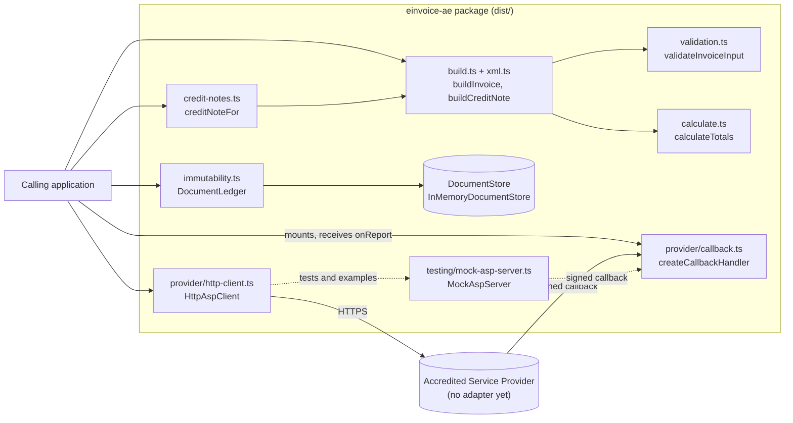

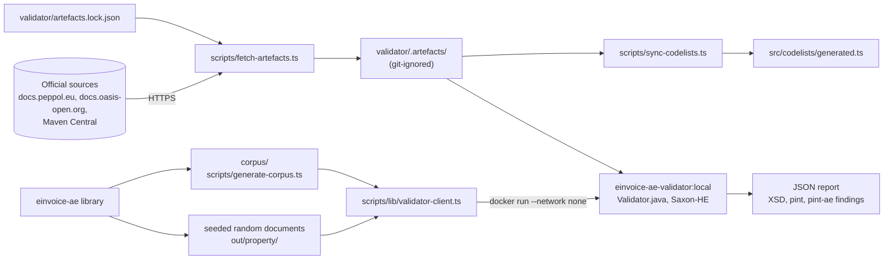

### 1.5 High-level data flow

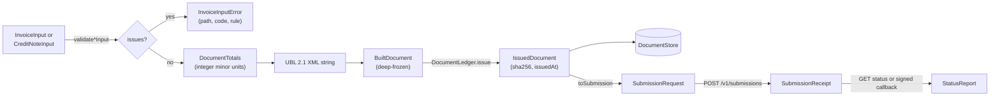

Data never leaves the calling process except through `HttpAspClient` (to the provider) and the callback handler (from the provider). The conformance tooling reads committed or generated XML files. It writes JSON reports and files under git-ignored folders (`validator/.artefacts/`, `out/`), and, when run without `--check`, the committed `corpus/` files and `src/codelists/generated.ts`.

---

## 2. Requirements

Status values: **Built** (in the code and tested), **Partly built**, **Planned** (named in the README roadmap; no code yet).

### 2.1 Functional requirements

| ID | Requirement | Module(s) | Status |
| --- | --- | --- | --- |
| FR-1 | Build a PINT AE Billing 1.0.4 Invoice (type 380 or 480) as UBL 2.1 XML from typed input. | 4.1, 4.4 | Built |
| FR-2 | Build a CreditNote (type 381 or 81) that references the credited invoice (IBG-03) and carries a reason (BTAE-03). | 4.4, 4.5 | Built |
| FR-3 | Support VAT categories S (5 %), Z, E (with exemption reason code), O and AE, with the rate fixed by the category. | 4.1, 4.3 | Built |
| FR-4 | Support the BTAE-02 transaction types: free trade zone, deemed supply, summary invoice, continuous supply, disclosed agent billing, e-commerce, exports. | 4.2, 4.4 | Built |
| FR-5 | Check the input before any XML is built and report every problem with a path, a code, a message and, where one applies, the official rule ID (101 rules mirrored). | 4.2 | Built |
| FR-6 | Compute line amounts, allowances and charges, the VAT breakdown and the totals IBT-106 to IBT-115 exactly in integer minor units. | 4.3 | Built |
| FR-7 | For a document not in AED, state the exchange rate (BTAE-04) and the AED amounts BTAE-08, BTAE-10, IBT-111 and BTAE-20. | 4.3, 4.4 | Built |
| FR-8 | Issue documents immutably: deep-freeze, SHA-256 fingerprint, refuse edits, deletions and a different document under an issued number; re-check the fingerprint on read. | 4.6 | Built |
| FR-9 | Accept a credit note only when it references exactly one invoice in the ledger (none for a volume discount), in the same currency, not dated before it, without taking the credited total above the invoice total. | 4.6 | Built |
| FR-10 | Build partial credit notes that pro-rate allowances, charges and VAT so that all credit notes for an invoice add up to it exactly. | 4.5 | Built |
| FR-11 | Submit issued documents to an ASP once (idempotency by document number), with per-attempt timeouts, backoff with full jitter and `Retry-After`; read and poll the status. | 4.7 | Partly built: the client targets the mock provider's API; no adapter for a real provider exists. |
| FR-12 | Accept signed status callbacks and hand each report to the application once per process. | 4.8 | Built |
| FR-13 | Provide a mock ASP with the same API and failure injection for local tests. | 4.9 | Built |
| FR-14 | Validate documents with the UBL 2.1 XSD and both official Schematron layers, using artefacts pinned by SHA-256. | 4.10, 4.11 | Built (development and CI tooling) |
| FR-15 | Keep the code lists the input checks use identical to the lists the official Schematron enforces. | 4.1, 4.10 | Built |
| FR-16 | Keep a committed corpus of valid, broken, gap and observation documents with a manifest of expected findings, checked against the library output. | 4.12 | Built |
| FR-17 | Map a TopFlow Hub order to an invoice and reconcile every amount. | 4.13 | Built as an example; not wired into TopFlow Hub. |
| FR-18 | Replace a rejected document under a new number, keeping the rejected one issued and unchanged. | 4.6, 4.7, 4.13 | Built (ledger and client behaviour; the application keeps the rejection records). |
| FR-19 | Persistent production `DocumentStore` (PostgreSQL), insert-only and safe across processes. | 4.6 | Planned |
| FR-20 | PINT AE Self-billing (types 389 and 261). | 4.4, 4.10 | Planned |
| FR-21 | VAT category N and the profit margin scheme. | 4.2, 4.3 | Planned |
| FR-22 | Human-readable PDF rendering of an issued document. | new | Planned |
| FR-23 | Adapters for real providers once they publish their APIs. | 4.7 | Planned |

### 2.2 Non-functional requirements

| ID | Requirement | Module(s) | Status |
| --- | --- | --- | --- |
| NFR-1 | Exactness: no binary floating point in money; every product rounded once, half away from zero; totals reproducible to the fil. | 4.3 | Built |
| NFR-2 | Determinism: the same input (with a fixed UUID) gives the same bytes, so fingerprints are stable. | 4.4 | Built |
| NFR-3 | Conformance: generated documents pass the UBL 2.1 XSD and both official Schematron layers, including at half-fil ties ([ADR-004](docs/decisions.md#adr-004-where-the-official-rules-use-binary-arithmetic-emit-the-value-they-accept)). | 4.3, 4.11, 4.12 | Built |
| NFR-4 | No runtime dependencies; ESM with type declarations; Node.js 20 or later. | 4.14 | Built |
| NFR-5 | Compatibility verified on Node.js 20, 22 and 24, and by installing the packed tarball. | 4.14 | Built |
| NFR-6 | Transport security: the API key and documents never travel over plain HTTP to another machine unless explicitly allowed. | 4.7 | Built |
| NFR-7 | Callback integrity: HMAC-SHA256 verified in constant time within a 300-second window. | 4.8 | Built |
| NFR-8 | Resilience: retrying a submission never creates a second one; failures end in typed errors. | 4.7, 4.9 | Built |
| NFR-9 | Supply chain: exact-pinned development dependencies with a lockfile; third-party artefacts pinned by SHA-256; base images pinned by digest; Dependabot updates. | 4.10, 4.14 | Built |
| NFR-10 | Licence compliance: no third-party specification files committed; the validation image is never pushed to a registry. | 4.10, 4.11 | Built |
| NFR-11 | Validator isolation: no network, memory and CPU limits, non-root user, read-only mount, no DOCTYPE. | 4.11 | Built |
| NFR-12 | Coverage cannot fall unnoticed: thresholds of 97 % lines, 95 % statements, 96 % functions, 91 % branches in `src/` (generated code-list file excluded). | 4.14 | Built |
| NFR-13 | Payment data: a full card number (IBT-087) is refused; only masked numbers are written. | 4.2 | Built |
| NFR-14 | Concurrency: the credit cap and number uniqueness hold under concurrent issuing. | 4.6 | Partly built: holds for one ledger object in one process, and the cap covers the credited total only (per-line quantities depend on a current `alreadyCredited`, 5.3 row 13); several processes need a store that enforces it (FR-19). |
| NFR-15 | Demo data only: all identifiers made up; every corpus document carries the note "DEMO - not a tax invoice". | 4.12 | Built |

---

## 3. Architecture

### 3.1 Architectural style

- **Library with a functional core.** Input checks, calculation, XML assembly and credit-note planning are pure functions over plain objects. Side effects live at three edges: storage (`DocumentStore`), outbound HTTP (`HttpAspClient`) and inbound HTTP (`createCallbackHandler`).
- **Ports and adapters at the edges.** `DocumentStore` is the storage port (adapter shipped: `InMemoryDocumentStore`); `AccreditedServiceProvider` is the provider port (adapter shipped: `HttpAspClient`, for the mock API shape). A production store and real provider adapters plug in without changes to the core.
- **Separate build-time subsystem.** The conformance tooling (artefact download, Java validator in Docker, corpus) is not part of the package. It proves that the library's output conforms; it is not called by the library.

### 3.2 Layers and boundaries

| Layer | Files | Depends on |
| --- | --- | --- |
| 1. Model, reference data and utilities | `src/model.ts`, `src/constants.ts`, `src/identifiers.ts`, `src/codelists/*`, `src/errors.ts`, `src/decimal.ts`, `src/money.ts`, `src/xml.ts`, `src/freeze.ts` | only each other (no other internal module) |
| 2. Rules and arithmetic | `src/validation.ts`, `src/calculate.ts`, `src/xpath-emulation.ts` | layer 1 |
| 3. Document assembly | `src/build.ts`, `src/credit-notes.ts` | layers 1 and 2 (`credit-notes.ts` also imports the `IssuedDocument` type from layer 4) |
| 4. Issue and storage port | `src/immutability.ts` | layer 1; types from layers 2 and 3 |
| 5. Provider port and adapter | `src/provider/*` | `errors.ts`; the `IssuedDocument` type |
| 6. Test double | `src/testing/*` | `provider/callback.ts` (`signCallback`, header names), `provider/types.ts`, `constants.ts` |

Boundaries:

- **Public API.** Only the three entry points in the `exports` map: `einvoice-ae` (`src/index.ts`), `einvoice-ae/provider` (`src/provider/index.ts`) and `einvoice-ae/testing` (`src/testing/index.ts`). The package ships `dist/`, `README.md` and `LICENSE` only (`files` in `package.json`).
- **Development only.** `corpus/`, `scripts/`, `examples/`, `validator/`, `test/` and the `.github/` workflows are never published.
- **Process boundary.** Java runs only inside the validation container; the host runs Node.js only.

### 3.3 Runtime and deployment topology

The library runs inside the caller's Node.js process; this repository provides no server or hosted service of its own. The diagram shows how an application would deploy it (top, not provided here) and how development and CI run (bottom).

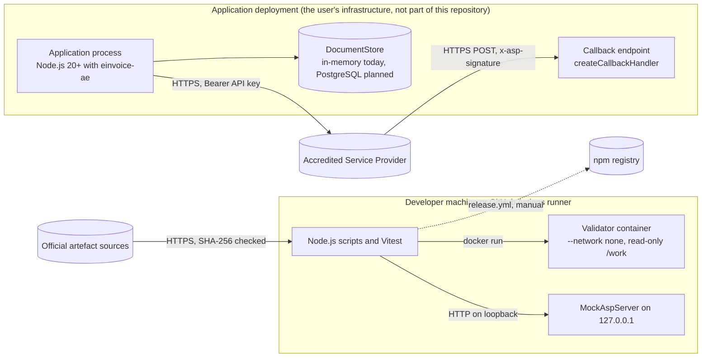

### 3.4 Key design decisions

The records are in [docs/decisions.md](docs/decisions.md); this table only summarises them.

| ADR | Decision in one line | Where it shows in the code |
| --- | --- | --- |
| [ADR-001](docs/decisions.md#adr-001-scope-is-pint-ae-billing-104-invoices-and-credit-notes) | Scope is PINT AE Billing 1.0.4: Invoice 380/480, CreditNote 381/81. | `PINT_AE` in `src/constants.ts` |
| [ADR-002](docs/decisions.md#adr-002-money-is-integer-minor-units-quantities-and-rates-are-decimal-text) | Money is integer minor units; quantities and rates are decimal text parsed into BigInt. | `src/decimal.ts`, `src/money.ts` |
| [ADR-003](docs/decisions.md#adr-003-vat-per-category-by-default-per-line-vat-as-an-option-with-a-guard) | VAT per category by default; per-line VAT as an option guarded by the 0.02 tolerance. | `vatRounding` in `calculateTotals` |
| [ADR-004](docs/decisions.md#adr-004-where-the-official-rules-use-binary-arithmetic-emit-the-value-they-accept) | Where two rules use binary doubles, emit the value they accept. | `src/xpath-emulation.ts` |
| [ADR-005](docs/decisions.md#adr-005-vat-rates-are-fixed-by-the-category-category-n-is-not-supported) | Rates are fixed by the category; category N is not supported. | `lineRate`, `documentLevelRate`; `UNSUPPORTED` |
| [ADR-006](docs/decisions.md#adr-006-line-amounts-in-aed-follow-the-bis-text) | Line amounts in AED follow the BIS text, not the Exports example. | `toAed` in `calculateLine` |
| [ADR-007](docs/decisions.md#adr-007-validation-artefacts-are-downloaded-and-pinned-not-committed) | Validation artefacts are downloaded and pinned, not committed. | `validator/artefacts.lock.json`, `scripts/lib/artefacts.ts` |
| [ADR-008](docs/decisions.md#adr-008-java-runs-only-in-a-docker-image-with-saxon-he-1210) | Java runs only in a Docker image with Saxon-HE 12.10. | `validator/Dockerfile` |
| [ADR-009](docs/decisions.md#adr-009-code-lists-come-from-the-schematron-with-a-drift-check) | Code lists come from the Schematron, with a drift check. | `scripts/sync-codelists.ts` |
| [ADR-010](docs/decisions.md#adr-010-input-checks-mirror-the-official-rules-the-schematron-stays-the-authority) | Input checks mirror the official rules; the Schematron stays the authority. | `src/validation.ts` |
| [ADR-011](docs/decisions.md#adr-011-a-corpus-of-valid-broken-and-gap-documents) | A corpus of valid, broken and gap documents. | `corpus/` |
| [ADR-012](docs/decisions.md#adr-012-no-runtime-dependencies-a-small-deterministic-xml-writer) | No runtime dependencies; a small deterministic XML writer. | `src/xml.ts` |
| [ADR-013](docs/decisions.md#adr-013-issued-documents-are-fingerprinted-and-frozen-corrections-are-credit-notes) | Issued documents are fingerprinted and frozen; corrections are credit notes. | `src/immutability.ts` |
| [ADR-014](docs/decisions.md#adr-014-provider-client-with-idempotency-keys-full-jitter-backoff-and-signed-callbacks) | Provider client with idempotency keys, full-jitter backoff and signed callbacks. | `src/provider/` |
| [ADR-015](docs/decisions.md#adr-015-tooling-versions-chosen-for-nodejs-20-support) | Tooling versions chosen for Node.js 20 support. | `package.json`, `.github/dependabot.yml` |
| [ADR-016](docs/decisions.md#adr-016-volume-discount-credit-notes-follow-the-published-rule-not-the-bis-text) | Volume discount credit notes follow the published ibr-055-ae. | `validateCreditNoteInput` |
| [ADR-017](docs/decisions.md#adr-017-provider-tests-use-a-configurable-port-range-and-close-every-connection) | Provider tests use a configurable port range and close every connection. | `test/support/ports.ts` |
| [ADR-018](docs/decisions.md#adr-018-the-topflow-hub-mapping-reconstructs-the-list-price-and-takes-missing-data-as-options) | The TopFlow Hub mapping reconstructs the list price and takes missing data as options. | `examples/topflow-order.ts` |
| [ADR-019](docs/decisions.md#adr-019-partial-credit-notes-are-pro-rated-on-the-cumulative-credited-quantity) | Partial credit notes are pro-rated on the cumulative credited quantity. | `src/credit-notes.ts` |
| [ADR-020](docs/decisions.md#adr-020-a-rejected-document-is-replaced-under-a-new-number) | A rejected document is replaced under a new number. | `examples/submit-to-mock-asp.ts` |

---

## 4. Modules

| § | Module | Main files | Shipped in |
| --- | --- | --- | --- |
| 4.1 | Input model, identifiers and code lists | `src/model.ts`, `src/constants.ts`, `src/identifiers.ts`, `src/codelists/` | `einvoice-ae` |
| 4.2 | Input validation and errors | `src/validation.ts`, `src/errors.ts` | `einvoice-ae` |
| 4.3 | Money and calculation | `src/decimal.ts`, `src/money.ts`, `src/calculate.ts`, `src/xpath-emulation.ts` | `einvoice-ae` |
| 4.4 | Document builder and XML writer | `src/build.ts`, `src/xml.ts`, `src/freeze.ts` | `einvoice-ae` |
| 4.5 | Credit-note builder | `src/credit-notes.ts` | `einvoice-ae` |
| 4.6 | Issuing and document ledger | `src/immutability.ts` | `einvoice-ae` |
| 4.7 | Provider client and retry policy | `src/provider/http-client.ts`, `retry.ts`, `types.ts` | `einvoice-ae/provider` |
| 4.8 | Status callbacks | `src/provider/callback.ts` | `einvoice-ae/provider` |
| 4.9 | Mock Accredited Service Provider | `src/testing/mock-asp-server.ts`, `scripts/mock-asp.ts` | `einvoice-ae/testing` |
| 4.10 | Validation artefacts and code-list sync | `validator/artefacts.lock.json`, `scripts/fetch-artefacts.ts`, `scripts/lib/artefacts.ts`, `scripts/lib/zip.ts`, `scripts/sync-codelists.ts`, `scripts/lib/codelist-extract.ts` | not shipped |
| 4.11 | Validator image and validator client | `validator/Dockerfile`, `validator/src/main/java/ae/einvoice/validator/Validator.java`, `scripts/lib/validator-client.ts`, `scripts/validate.ts` | not shipped |
| 4.12 | Conformance corpus | `corpus/*.ts`, `corpus/manifest.json`, `corpus/{valid,invalid,gaps,observations}/`, `scripts/generate-corpus.ts` | not shipped |
| 4.13 | Examples and TopFlow Hub mapping | `examples/*.ts` | not shipped |
| 4.14 | CI, release, packaging and test harness | `.github/`, `scripts/smoke-pack.mjs`, `package.json`, `tsconfig*.json`, `vitest*.config.ts`, `eslint.config.js`, `test/support/` | not shipped |

No module uses a database or has a user interface: einvoice-ae is a library and a set of command-line tools. The "Database interaction" and "Frontend interaction" rows say so per module and name the nearest equivalent (the `DocumentStore` port, console output).

### 4.1 Input model, identifiers and code lists

| Heading | Detail |
| --- | --- |
| Purpose | Define the typed description of a document that callers fill in, with each field named after its PINT AE business term (IBT-xxx, BTAE-xx), and the fixed identifiers, UAE identifier formats and code lists the other modules read. |
| Requirements | FR-1 to FR-4, FR-15; NFR-1 (money is typed as integer `MinorUnits`). |
| Architecture | Types and constants only, no I/O. `src/codelists/generated.ts` is produced from the official Schematron by `npm run codelists:sync`; `src/codelists/pint-ae.ts` is kept by hand with names for messages ([ADR-009](docs/decisions.md#adr-009-code-lists-come-from-the-schematron-with-a-drift-check)). |
| Workflow | The caller fills an `InvoiceInput` or `CreditNoteInput` and passes it to `buildInvoice`/`buildCreditNote` (4.4) or `validateInvoiceInput`/`validateCreditNoteInput` (4.2). The generated lists change only through `npm run codelists:sync` (4.10). |
| Components | Types `InvoiceInput`, `CreditNoteInput`, `LineInput`, `Seller`, `Buyer`, `LineTax`, `DocumentAllowanceCharge`, `PaymentMeans`, `Delivery`; constants `PINT_AE`, `PREDEFINED_ENDPOINTS`, `UBL_NAMESPACES`; functions `isValidTrn`, `isValidTin`, `isPredefinedEndpoint`, `isValidUaeEndpoint`; 13 generated sets (for example `UNIT_CODES`, `CURRENCY_CODES`, `EMIRATE_CODES`, `TAX_CATEGORY_CODES`); hand-kept maps `TAX_CATEGORIES`, `SUPPORTED_TAX_CATEGORIES`, `EMIRATES`, `CREDIT_NOTE_REASONS`, `TRANSACTION_TYPE_FLAGS`, `INVOICE_TYPE_CODES`, `CREDIT_NOTE_TYPE_CODES`. |
| APIs | TypeScript exports of `einvoice-ae` (`src/index.ts`): `export type * from './model.js'`, both code-list files, the constants and the identifier functions. No HTTP API. |
| Data flow | Static; read by 4.2 (checks), 4.3 (rates) and 4.4 (identifiers and namespaces). |
| Database interaction | Not applicable: static definitions with nothing to store. |
| Frontend interaction | Not applicable: no user interface; callers use the types from their own code. |
| Backend interaction | None at run time. In development, `scripts/sync-codelists.ts` rewrites `generated.ts` from `validator/.artefacts/`. |
| Authentication/authorization | Not applicable: no network access and no users. |
| Validation | TRN `^1\d{12}03$` (ibr-132-ae), TIN `^1\d{9}$` (ibr-148-ae); no checksum is invented ([ADR-010](docs/decisions.md#adr-010-input-checks-mirror-the-official-rules-the-schematron-stays-the-authority)). Compile-time checks from `strict`, `exactOptionalPropertyTypes` and `noUncheckedIndexedAccess`. |
| Error handling | The identifier functions return booleans; problems are reported as issues by 4.2. |
| Testing | `test/unit/identifiers-xml.test.ts` (TRN, TIN, predefined endpoints); `test/unit/codelists.test.ts` (hand-kept lists equal the generated ones; every official category except N is supported). |
| Deployment | Compiled to `dist/` by `npm run build` (`tsc -p tsconfig.build.json`) and shipped in the package. |

### 4.2 Input validation and errors

| Heading | Detail |
| --- | --- |
| Purpose | Check typed input before any XML is built and return every problem with a path, a code, a plain-language message and the official rule ID it mirrors ([ADR-010](docs/decisions.md#adr-010-input-checks-mirror-the-official-rules-the-schematron-stays-the-authority)). |
| Requirements | FR-4, FR-5, FR-21 (refuses N for now); NFR-13. |
| Architecture | Pure functions with an internal `Issues` collector. A `DocumentContext` (kind, type code, out-of-scope flag, transaction-type flags) steers the rules that depend on the document type. The 101 mirrored rules are listed in [docs/spec-coverage.md](docs/spec-coverage.md#how-rules-are-handled). |
| Workflow | `validateInvoiceInput`: type code (ibr-cl-01) → `validateCommon` (id, UUID, dates, issue time, references, currency and exchange rate, invoice period, transaction-type flags, seller, buyer, delivery, payment means, document-level allowances and charges, lines, prepaid and rounding amounts, `vatRounding`) → invoice-only checks (`standardRatedVat` not allowed, `dueDate`, `taxPointDate` before the issue date, ibr-141-ae). `validateCreditNoteInput` adds the reason (ibr-158-ae, ibr-001-ae), refuses `taxPointDate` (ibr-124-ae) and `dueDate`, and applies the preceding-invoice rule ibr-055-ae ([ADR-016](docs/decisions.md#adr-016-volume-discount-credit-notes-follow-the-published-rule-not-the-bis-text)). |
| Components | `validateInvoiceInput`, `validateCreditNoteInput`, `isIsoDate`; `ValidationIssue`; error classes `EInvoiceError` (base), `InvoiceInputError` (`issues`), `CalculationError` (`code`, `rule`, `path`), `ImmutableDocumentError` (`documentId`). |
| APIs | Exported from `einvoice-ae`. Both functions return `ValidationIssue[]`; an empty array means the input can be built. |
| Data flow | In: `InvoiceInput` or `CreditNoteInput`. Out: issues such as `{ path: 'seller.trn', code: 'INVALID_TRN', message: 'must be 15 digits, start with 1 and end with 03', rule: 'ibr-132-ae' }`. |
| Database interaction | Not applicable: stateless checks. |
| Frontend interaction | Not applicable: no user interface. `InvoiceInputError.message` is plain text a caller can show or log (see `npm run example:errors`), and `issues[].path` can be mapped to form fields (it is `''` for most issues converted from a `CalculationError`; see 5.1, row 6). |
| Backend interaction | Called by `buildInvoice` and `buildCreditNote` (4.4). Reads the code lists (4.1) and `containsInvalidXmlCharacter` from `src/xml.ts`. |
| Authentication/authorization | Not applicable: no users or network access. |
| Validation | Codes include `REQUIRED`, `INVALID_TYPE`, `EMPTY` (ibr-079), `INVALID_CHARACTER`, `INVALID_DATE` (ibr-073), `INVALID_TIME` (ibr-119), `INVALID_AMOUNT`, `AMOUNT_TOO_LARGE` (above `MAX_AMOUNT_MINOR`, 100 000 000 000 000 minor units), `NEGATIVE_AMOUNT`, `INVALID_DECIMAL`, `NOT_POSITIVE`, `INVALID_CODE`, `INVALID_TRN`, `INVALID_TIN`, `INVALID_ENDPOINT`, `INVALID_EMIRATE` (ibr-128-ae), `CARD_NUMBER_NOT_MASKED`, `TOO_MANY_CARDS` (ibr-066), `UNSUPPORTED`, `NOT_ALLOWED`, `CATEGORY_NOT_ALLOWED` (ibr-122-ae), `DUPLICATE_LINE_ID`, `OUTSIDE_INVOICE_PERIOD` (ibr-085, ibr-086), `ONLY_EXEMPT_OR_OUT_OF_SCOPE` (ibr-151-ae), `UNKNOWN_FLAG`, `INVALID_OPTION`. |
| Error handling | The validation functions do not throw for bad input; they collect every issue. `buildInvoice` and `buildCreditNote` throw one `InvoiceInputError`: its message is `<path>: <message>` for one issue, or `<n> problems in the document input:` followed by one `  - <path>: <message> [<rule>]` line per issue. |
| Testing | `test/unit/validation.test.ts`; `test/unit/rule-parity.test.ts` (a case for every rule ID cited in `validation.ts`, `calculate.ts` and `build.ts`, and a check that the list and count match `docs/spec-coverage.md`); `test/unit/readme-example.test.ts` (the README shows the real output of `npm run example:errors`). |
| Deployment | Shipped in the package (`dist/validation.js`, `dist/errors.js`). |

### 4.3 Money and calculation

| Heading | Detail |
| --- | --- |
| Purpose | Compute line amounts, allowances and charges, the VAT breakdown, document totals and AED amounts exactly ([ADR-002](docs/decisions.md#adr-002-money-is-integer-minor-units-quantities-and-rates-are-decimal-text) to [ADR-006](docs/decisions.md#adr-006-line-amounts-in-aed-follow-the-bis-text)). |
| Requirements | FR-3, FR-6, FR-7; NFR-1, NFR-3. |
| Architecture | Scaled BigInt decimals (`Decimal { units, scale }`), one rounding step per product, half away from zero (`divideRoundHalfUp`). For ibr-147-ae and ibr-131-ae/ibr-146-ae, which the Schematron evaluates in binary doubles, `xpath-emulation.ts` re-evaluates the rule and the calculation picks the exact value or the neighbour the rule accepts. |
| Workflow | Per line (`calculateLine`): parse quantity and base quantity → resolve allowances and charges (`resolveAllowanceCharge`) → item amount = quantity × price ÷ base quantity, rounded once → choose the net amount `passesLineNetAmountRule` accepts → line VAT 5 % for S, 0 for Z, O and AE, none for E → AED amounts. Then group by category, add document-level items, compute category VAT (`'category'` default, per-line sum with `'line'`, or the stated `standardRatedVat` on credit notes), totals IBT-106 to IBT-115 and, for a foreign currency, IBT-111 and BTAE-20. |
| Components | `calculateTotals`, `lineRate`, `documentLevelRate`; types `DocumentTotals`, `LineTotals`, `TaxBreakdown`, `ResolvedAllowanceCharge`, `DocumentLevelAllowanceCharge`, `CalculationInput`; `parseDecimal`, `divideRoundHalfUp`, `addDecimal`, `compareDecimal`; `formatAmount`, `parseAmount`, `percentOf`, `convertAmount`, `MAX_AMOUNT_MINOR`, `MINOR_UNITS_PER_UNIT`; `passesLineNetAmountRule`, `passesAllowanceChargeRule`. |
| APIs | `calculateTotals(input: CalculationInput): DocumentTotals` and the money helpers are exported from `einvoice-ae`. |
| Data flow | In: validated input (amounts as integers, quantities and rates as decimal strings). Out: `DocumentTotals`, every amount converted back to a number only after `safe()` checks it is within `Number.MAX_SAFE_INTEGER`. |
| Database interaction | Not applicable: pure arithmetic. |
| Frontend interaction | Not applicable: no user interface; `formatAmount` gives the two-decimal text used in the XML. |
| Backend interaction | Called by `buildInvoice`, `buildCreditNote` and `creditNoteFor`; calls nothing outside the module. |
| Authentication/authorization | Not applicable. |
| Validation | `parseDecimal` accepts plain decimal text of at most 40 characters (`MAX_DECIMAL_LENGTH`) and refuses exponent notation, NaN and Infinity. Per-line VAT and a stated VAT must stay within 0.02 of taxable amount × 5 % (aligned-ibrp-s-09). |
| Error handling | Throws `CalculationError` with codes `MISSING_AMOUNT`, `ALLOWANCE_CHARGE_MISMATCH` (ibr-131-ae or ibr-146-ae), `LINE_AMOUNT_ROUNDING` (ibr-147-ae), `NEGATIVE_LINE_AMOUNT`, `NEGATIVE_TAXABLE_AMOUNT`, `NOT_APPLICABLE` (`standardRatedVat` without an S item), `VAT_ROUNDING_DRIFT` (aligned-ibrp-s-09), `AMOUNT_TOO_LARGE`, `INVALID_DECIMAL`. The builder converts these to `InvoiceInputError`. Money helpers throw `RangeError` for non-integer or oversized values. |
| Testing | `test/unit/calculate.test.ts` (including the totals formulas over 500 seeded random documents); `test/unit/decimal-money.test.ts`; `test/unit/identifiers-xml.test.ts` (emulation of the double-precision rules). The conformance suite validates `corpus/valid/allowances-and-charges.xml` (the 1.05 × 36.90 tie) and `corpus/observations/line-amount-decimal-half-up-tie.xml`. |
| Deployment | Shipped in the package. |

### 4.4 Document builder and XML writer

| Heading | Detail |
| --- | --- |
| Purpose | Turn validated input into UBL 2.1 Invoice or CreditNote XML in the exact schema element order, with deterministic bytes, and return a deep-frozen `BuiltDocument`. |
| Requirements | FR-1, FR-2, FR-4, FR-7; NFR-2, NFR-3. |
| Architecture | Builds an in-memory `XmlElement` tree with `element`, `textElement`, `optionalText` and `optionalElement`, and serialises it once with `serialise`. `invoiceXml` and `creditNoteXml` are separate because the UBL root sequences differ ([ADR-012](docs/decisions.md#adr-012-no-runtime-dependencies-a-small-deterministic-xml-writer)). |
| Workflow | Validate (4.2) → `calculateOrThrow` (4.3) → follow-up checks (invoice: due date when an amount is due unless deemed supply, ibr-127-ae; amount due not negative) → UUID from `input.uuid`, else `options.generateUuid`, else `crypto.randomUUID` → assemble and serialise → `deepFreeze({ kind, id, uuid, issueDate, typeCode, currency, xml, totals })`. |
| Components | `buildInvoice`, `buildCreditNote`, `transactionTypeCode`, `BuildOptions`, `BuiltDocument`; `serialise`, `escapeText`, `escapeAttribute`, `containsInvalidXmlCharacter`; `deepFreeze` (`src/freeze.ts`). |
| APIs | `buildInvoice(input, options?)`, `buildCreditNote(input, options?)`, `transactionTypeCode(flags)`, exported from `einvoice-ae`. |
| Data flow | In: `InvoiceInput` or `CreditNoteInput`. Out: `BuiltDocument.xml` (XML declaration, UTF-8, two-space indentation, LF line ends, trailing newline) and a cloned `totals`. |
| Database interaction | Not applicable: nothing is stored until the document is issued (4.6). |
| Frontend interaction | Not applicable: the output is machine-readable XML; a human-readable rendering is planned (FR-22). |
| Backend interaction | Calls 4.2 and 4.3; its output goes to `DocumentLedger.issue` or `issueDocument` (4.6). |
| Authentication/authorization | Not applicable. |
| Validation | The writer refuses empty elements (ibr-079) and characters XML 1.0 cannot carry. The rules met by construction (for example `ibr-co-10` to `ibr-co-16`, one VAT breakdown per category, AED line amounts) are listed in [docs/spec-coverage.md](docs/spec-coverage.md#how-rules-are-handled). |
| Error handling | `InvoiceInputError` for every input problem, including converted `CalculationError`s and the follow-ups `REQUIRED` at `dueDate` (ibr-127-ae) and `NEGATIVE_AMOUNT_DUE` at `prepaidAmount`. The writer's plain `Error`s (`Element <name> would be empty`, `Invalid XML character in <name>`) are a last guard that validated input does not reach. |
| Testing | `test/unit/build.test.ts` (UBL element order for every scenario, header fields, determinism, credit-note structure); `test/unit/identifiers-xml.test.ts` (writer); `test/unit/immutability.test.ts` (built documents frozen, caller input not frozen); `test/unit/corpus.test.ts`; the conformance suite. |
| Deployment | Shipped in the package. |

### 4.5 Credit-note builder

| Heading | Detail |
| --- | --- |
| Purpose | Build the input for a whole or partial credit note from the original invoice input, so that all credit notes for an invoice add up to it exactly ([ADR-019](docs/decisions.md#adr-019-partial-credit-notes-are-pro-rated-on-the-cumulative-credited-quantity)). |
| Requirements | FR-2, FR-10. |
| Architecture | One pure function over the original `InvoiceInput`, the issued invoice's identity and totals, and the quantities earlier credit notes took. Each amount A that depends on quantity is credited as round(A × c1 / Q) − round(A × c0 / Q), so the parts telescope. |
| Workflow | Check kind, number and date → `calculateTotals(originalInput)` and compare the total with the issued invoice → `planLines` (checks `alreadyCredited` and the requested lines and quantities) → whole credit: copy lines and document-level items; partial credit: `partialLine` per line plus a rounding residual per VAT category → `documentLevelCredit` pro-rates document-level items and the S VAT (`standardRatedVat`) → residuals become an allowance or charge with reason `ROUNDING_ADJUSTMENT_REASON` → type code 381, or 81 for a 480 invoice or when only E and O lines are credited → `CreditNoteInput` with `precedingInvoices`. |
| Components | `creditNoteFor`, `CreditNoteDetails`, `ROUNDING_ADJUSTMENT_REASON` ("Rounding difference to the invoiced amount"); internal `planLines`, `partialLine`, `documentLevelCredit`, `roundingItem`. |
| APIs | `creditNoteFor(originalInput, issuedInvoice, details): CreditNoteInput`, exported from `einvoice-ae`. |
| Data flow | In: original input, `IssuedDocument` fields `kind`, `id`, `issueDate`, `typeCode` and optionally `totals`, and `details.alreadyCredited` from `DocumentLedger.creditedQuantities(invoiceId)`. Out: `CreditNoteInput` for `buildCreditNote`. |
| Database interaction | Not applicable: the function reads and writes nothing; the caller reads `alreadyCredited` from the ledger's store (4.6). |
| Frontend interaction | Not applicable. |
| Backend interaction | Calls `calculateTotals`; its result goes to `buildCreditNote` and then `DocumentLedger.issue`. |
| Authentication/authorization | Not applicable. |
| Validation | Refuses a non-invoice, an input for another number, a date before the invoice, an input whose total differs from the issued invoice, unknown or repeated lines, an empty line list, zero or excessive quantities, `alreadyCredited` outside 0 to the invoiced quantity, and an invoice already credited in full. The reason type excludes `VD`. |
| Error handling | Throws `EInvoiceError`, for example `Invoice <id> has already been credited in full` or `Line <n> of invoice <id> was invoiced with quantity <q> and <c> has already been credited; <r> cannot be credited`. Nothing is built or stored. |
| Testing | `test/unit/credit-notes.test.ts` (sums for 150 seeded random invoices split at random, stated VAT within 0.02); `test/unit/immutability.test.ts` (`creditNoteFor` section); `test/conformance/property-validation.test.ts` (80 seeded invoices and their partial credit notes through the official validator). |
| Deployment | Shipped in the package. |

### 4.6 Issuing and document ledger

| Heading | Detail |
| --- | --- |
| Purpose | Mark built documents as issued (SHA-256 fingerprint, deep freeze), keep a register that refuses edits, deletions and reuse of a number, and enforce the credit-note rules ([ADR-013](docs/decisions.md#adr-013-issued-documents-are-fingerprinted-and-frozen-corrections-are-credit-notes)). |
| Requirements | FR-8, FR-9, FR-18, FR-19 (planned store); NFR-14. |
| Architecture | Storage port `DocumentStore` (`get`, `insert`, `list`) with the in-memory adapter `InMemoryDocumentStore`. `DocumentLedger.issue` chains calls on a promise queue, so calls on one ledger object run one at a time and a check cannot be separated from its insert by another call. |
| Workflow | `issue(built)` → wait for earlier calls → `store.get(id)`: same hash returns the stored record, a different hash is refused → `issueDocument` (`assertMatchesXml`, `documentHash`, `creditedInvoiceIds` from `cac:InvoiceDocumentReference`, `deepFreeze`) → for a credit note the private credit check → `store.insert`. |
| Components | `issueDocument`, `documentHash`, `verifyDocument`, `assertUnmodified`, `DocumentLedger` (`issue`, `get`, `verify`, `update`, `delete`, `creditedQuantities`, `creditedAmount`), `DocumentStore`, `InMemoryDocumentStore`, `OverCreditError`, `IssuedDocument`. |
| APIs | Exported from `einvoice-ae`. `update` and `delete` exist only to refuse. |
| Data flow | In: `BuiltDocument`. Out: `IssuedDocument` (adds `sha256`, `issuedAt`, `creditedInvoiceIds`), stored in the `DocumentStore`. |
| Database interaction | Only through `DocumentStore`. The shipped adapter is a `Map` keyed by document number; `insert` rejects an existing number and there is no update or delete. No SQL schema or table exists. A production store must be insert-only (for example no UPDATE or DELETE grants) and, when several processes share it, make the number check and the credit cap atomic with the insert, for example in one transaction that locks the invoice row ([README](README.md#limitations-and-roadmap)); a PostgreSQL store is planned (section 7). `creditedAmount` and `creditedQuantities` scan `store.list()`. |
| Frontend interaction | Not applicable. |
| Backend interaction | Called by the application after building; `creditedQuantities` feeds `creditNoteFor` (4.5); the issued record feeds `toSubmission` (4.7). |
| Authentication/authorization | Not applicable inside the library. Who may issue or credit documents is the application's decision; the store's database grants should forbid UPDATE and DELETE. |
| Validation | `assertMatchesXml` compares document type, number, UUID, issue date, type code, currency, total with VAT and line quantities with the XML. `get` re-checks the fingerprint. Credit check: one referenced invoice in the ledger, same currency, not dated before it, cap on the total with VAT. |
| Error handling | `ImmutableDocumentError` for a changed document, edits, deletions, a fingerprint mismatch and a duplicate store insert; `EInvoiceError` for a record that disagrees with its XML and for credit-note reference, currency and date problems; `OverCreditError` (`invoiceId`, `invoiceTotal`, `alreadyCredited`, `requested`) for the cap. A refused call does not block the queue. |
| Testing | `test/unit/immutability.test.ts`: fingerprint of the UTF-8 bytes, freezing, idempotent issue, refusals, tampered XML, cap under three concurrent credit notes, concurrent identical issues, recovery after a refused document, store-level duplicate. |
| Deployment | Shipped in the package. |

### 4.7 Provider client and retry policy

| Heading | Detail |
| --- | --- |
| Purpose | Submit issued documents to an ASP exactly once, retrying safely, and read their status ([ADR-014](docs/decisions.md#adr-014-provider-client-with-idempotency-keys-full-jitter-backoff-and-signed-callbacks)). |
| Requirements | FR-11, FR-18, FR-23 (planned adapters); NFR-6, NFR-8. |
| Architecture | Port `AccreditedServiceProvider` (`submit`, `getStatus`); adapter `HttpAspClient` for the API shape of the mock provider, because no provider API is standardised. `fetch`, `sleep`, `random` and `onRetry` can be injected. |
| Workflow | Constructor checks options → `submit` builds headers → `#send` checks that headers and URL can be built (no network) → each attempt: `AbortSignal.timeout(timeoutMs)` combined with the caller's signal → `fetch` → body read inside the attempt → success: parse JSON; non-retryable status: throw; retryable: wait `Retry-After` or `backoffDelay` and try again. |
| Components | `HttpAspClient` (`submit`, `getStatus`, `waitForFinalStatus`), `HttpAspClientOptions`, `RetryEvent`, `toSubmission`; errors `AspError`, `AspRequestError`, `AspConflictError`, `AspUnavailableError`; `DEFAULT_RETRY_POLICY` (5 attempts, 250 ms base, 10 000 ms cap), `backoffDelay`, `isRetryableStatus`, `parseRetryAfter`; internal `sleep`, `anySignal`. |
| APIs | Library: `einvoice-ae/provider`. Outbound HTTP: `POST {baseUrl}/v1/submissions` (body: UBL XML; headers `authorization: Bearer <apiKey>`, `accept: application/json`, `content-type: application/xml; charset=utf-8`, `idempotency-key` (document number, percent-encoded UTF-8), `x-document-sha256`, `x-document-type`, optional `x-callback-url`), expecting JSON `{ submissionId, invoiceId, status, receivedAt }` and reading the `idempotent-replayed` header; `GET {baseUrl}/v1/submissions/{id}`, expecting `{ submissionId, invoiceId, status, updatedAt, errors }`. |
| Data flow | `IssuedDocument` → `toSubmission` → `SubmissionRequest` → HTTP → `SubmissionReceipt` (with `attempts` and `replayed`) or `StatusReport`. |
| Database interaction | Not applicable: the client keeps no state. The application stores receipts and reports in its own submission records ([ADR-020](docs/decisions.md#adr-020-a-rejected-document-is-replaced-under-a-new-number)). |
| Frontend interaction | Not applicable. |
| Backend interaction | HTTPS to the provider; HTTP on loopback to `MockAspServer` in tests and examples. |
| Authentication/authorization | Bearer API key on every request. `baseUrl` and `callbackUrl` must use https unless the host is this machine (`localhost`, `*.localhost`, `127.0.0.0/8`, `::1`) or `allowInsecureHttp: true` is set for a test set-up. |
| Validation | Options: `timeoutMs` a whole number from 1 to 2 147 483 647; `retry.maxAttempts` 1 to 100; delays 0 to 2 147 483 647; `apiKey` present and sendable in a header. Responses: required string fields present and `status` one of `received`, `accepted`, `rejected`. |
| Error handling | Retries network errors, timeouts and HTTP 408, 425, 429, 500, 502, 503, 504. `AspRequestError` for any non-2xx status that is not retried (other 4xx, and 5xx other than 500, 502, 503 and 504) and for requests that cannot be sent (then `status` is undefined); `AspConflictError` (a subclass of `AspRequestError`) for 409; `AspRequestError` for a successful response that is not JSON or not a JSON object; `AspUnavailableError` after the last attempt, or at once with `retryAfterMs` when `Retry-After` exceeds `retry.maxDelayMs`; `AspError` for a missing field, an unknown status and `waitForFinalStatus` timing out. A caller abort ends the loop with the abort reason. |
| Testing | `test/provider/http-client.test.ts` (against `MockAspServer`: retries, `Retry-After`, dropped connections, timeouts, lost responses, idempotency, 409, aborts, https rule, non-ASCII document numbers); `test/provider/retry-callback.test.ts` (backoff ranges, retryable statuses, `Retry-After` parsing, signals, response handling, headers sent). |
| Deployment | Shipped as `einvoice-ae/provider`. |

### 4.8 Status callbacks

| Heading | Detail |
| --- | --- |
| Purpose | Let the application accept status reports pushed by the provider, verify that they are genuine and recent, and hand each to the application once. |
| Requirements | FR-12; NFR-7. |
| Architecture | `verifyCallback` is a pure function. `createCallbackHandler` returns a `node:http` request handler that remembers each verified signature (with the outcome of handling it) until the tolerance window closes, per handler and per process. |
| Workflow | Method check → read the body up to `maxBodyBytes` → `verifyCallback` → if the signature was seen, answer as the first delivery is answered → otherwise call `onReport` → 204 on success, 500 on failure. |
| Components | `signCallback`, `verifyCallback`, `VerifyCallbackInput`, `createCallbackHandler`, `CallbackVerificationError`, `SIGNATURE_HEADER` (`x-asp-signature`), `TIMESTAMP_HEADER` (`x-asp-timestamp`). |
| APIs | An endpoint the application hosts: `POST <callback URL>` with `x-asp-signature: sha256=<hex HMAC-SHA256 of "<timestamp>.<body>">`, `x-asp-timestamp: <Unix seconds>` and a JSON `StatusReport` body. Answers 204, 401, 405 (with `allow: POST`), 413 or 500. |
| Data flow | Provider → JSON → `StatusReport` → `onReport(report)` in the application. |
| Database interaction | Not applicable in the library. `onReport` is where the application stores the report, and it must be idempotent: the same report can arrive twice with fresh signatures, and the replay memory is per process. |
| Frontend interaction | Not applicable. |
| Backend interaction | Mounted by the application, for example `createServer(createCallbackHandler({ secret, onReport }))` in `examples/submit-to-mock-asp.ts`. |
| Authentication/authorization | Shared-secret HMAC-SHA256 compared with `timingSafeEqual`; timestamps more than 300 seconds (`toleranceSeconds`) from now are refused. |
| Validation | Timestamp must be digits; the body must be JSON with string `submissionId`, `invoiceId`, `updatedAt`, a `status` of `received`, `accepted` or `rejected`, and an `errors` array. |
| Error handling | Any verification failure → 401 with no detail in the response. Body above `maxBodyBytes` (default 64 KiB) → 413, then the connection is closed without reading the rest. `onReport` throws or rejects → 500, and the signature is forgotten so the provider's redelivery is handled again. |
| Testing | `test/provider/retry-callback.test.ts` ("callback signatures"); `test/provider/http-client.test.ts` ("status callbacks", "callback handler": POST only, size limit, closing after 413, replay handled once, repeat during the first delivery waits for its outcome, 500 on application failure). |
| Deployment | Shipped as `einvoice-ae/provider`; runs inside the application's HTTP server. |

### 4.9 Mock Accredited Service Provider

| Heading | Detail |
| --- | --- |
| Purpose | A local stand-in with the same API as `HttpAspClient`, with failure injection, for tests and demonstrations. It is not a real ASP and runs only structural checks. |
| Requirements | FR-13; NFR-8 (makes the retry behaviour testable). |
| Architecture | A `node:http` server with in-memory maps by submission id and by idempotency key, a queue of injected faults, timers for processing and callback delivery, and a `decide` function (default `defaultDecision`). |
| Workflow | Request → `GET /health` answered without authentication → API key check → take the next matching fault → route → content type → idempotency key → callback URL allow-list → body size → digest → known key: replay or 409 → new key: store as `received`, answer 202 → after `processingDelayMs` (default 20 ms; 500 ms in `npm run mock-asp`) run `decide` → deliver a signed callback, up to 3 attempts. |
| Components | `MockAspServer` (`listen`, `url`, `close`, `injectFaults`, `injectFaultsFor`, `submissions`, `callbackDeliveries`, `requestCount`), `defaultDecision`; types `Fault` (`status`, `reset`, `delay`, `error-after-processing`), `Decision`, `MockAspOptions`, `StoredSubmission`, `CallbackDelivery`. |
| APIs | `GET /health` → 200 `{"status":"ok"}`. `POST /v1/submissions` → 202 (new), 200 with `idempotent-replayed: true` (same key and digest), 400, 401, 409, 413, 415. `GET /v1/submissions/{id}` → 200 or 404. Any other route → 404 (after the API key check). JSON responses carry `connection: close`. |
| Data flow | XML body and headers → `StoredSubmission` in memory → receipt or status report; signed callback `POST` to the submission's callback URL. |
| Database interaction | Not applicable: everything is kept in memory and lost on `close()`. |
| Frontend interaction | Not applicable; `npm run mock-asp` prints its URL and routes to the console. |
| Backend interaction | Sends callbacks with the global `fetch` (5-second timeout), only to allowed hosts. |
| Authentication/authorization | `Authorization: Bearer <apiKey>` is checked before any fault is taken; otherwise 401. Callbacks are signed with `callbackSecret`. Callback hosts default to `localhost`, `127.0.0.1` and `::1` (`callbackHosts`), so the mock cannot be used to send requests to other machines. |
| Validation | `content-type` starting with `application/xml`; `Idempotency-Key` present and valid percent-encoded UTF-8; `X-Callback-URL` http(s) on an allowed host; body within `maxBodyBytes` (default 5 MiB); `X-Document-SHA256` equal to the SHA-256 of the body. `defaultDecision` checks the UBL root namespace, the PINT AE `CustomizationID` and a UUID. |
| Error handling | Error bodies are `{ "errors": [{ "code", "message" }] }` with codes `UNAUTHORISED`, `NOT_FOUND`, `UNSUPPORTED_MEDIA_TYPE`, `IDEMPOTENCY_KEY_REQUIRED`, `IDEMPOTENCY_KEY_INVALID`, `CALLBACK_URL_NOT_ALLOWED`, `TOO_LARGE`, `DIGEST_MISMATCH`, `IDEMPOTENCY_CONFLICT`, `INJECTED_FAULT`. An unexpected exception gives 500. Rejection codes from `defaultDecision`: `NOT_UBL`, `NOT_PINT_AE`, `NO_UUID`. |
| Testing | `test/provider/http-client.test.ts` ("mock ASP protocol checks": health without authentication, unknown routes, media types, missing keys, oversized bodies, callback allow-list, key checked before faults, custom decisions, rejection and replacement). Every provider test and `npm run example:submit` use it. |
| Deployment | Shipped as `einvoice-ae/testing`. `npm run mock-asp` (`scripts/mock-asp.ts`) runs it on 127.0.0.1 with `MOCK_ASP_PORT` (default 58800), `MOCK_ASP_API_KEY` and `MOCK_ASP_CALLBACK_SECRET` (workflow and failures in 5.12). Not hardened for a network: bind to loopback only. |

### 4.10 Validation artefacts and code-list sync

| Heading | Detail |
| --- | --- |
| Purpose | Download the third-party validation artefacts from their official sources, verify every file against a pinned SHA-256, unpack only what is needed, and derive the code lists from the official Schematron ([ADR-007](docs/decisions.md#adr-007-validation-artefacts-are-downloaded-and-pinned-not-committed), [ADR-009](docs/decisions.md#adr-009-code-lists-come-from-the-schematron-with-a-drift-check)). |
| Requirements | FR-14, FR-15; NFR-9, NFR-10. |
| Architecture | Node.js scripts run with tsx; an injectable `Fetcher`; a minimal ZIP reader on `node:zlib`; output in the git-ignored `validator/.artefacts/`. |
| Workflow | `npm run artefacts:fetch`: read the lock file → `fetchVerified` (reuse a cached file whose hash matches, otherwise download, verify, write) for the PINT AE archive → extract entries under the six `pintAe.extract` prefixes through `safeJoin` → 16 UBL 2.1 schema files → 3 jars → write `MANIFEST.json`. With `-- --upstream`, the same into a temporary folder, deleted afterwards. `npm run codelists:sync`: parse the two `.sch` files with `@xmldom/xmldom` → read the assert `test` of 13 rules → `extractCodes` → write `src/codelists/generated.ts`, or with `-- --check` compare only. |
| Components | `fetchArtefacts`, `checkUpstream`, `httpFetcher`, `verifyChecksum`, `ChecksumMismatchError`, `safeJoin`, `sha256`, `ArtefactLock`; `readZip`; `extractCodes`; the `LISTS` table in `scripts/sync-codelists.ts`. |
| APIs | Commands `npm run artefacts:fetch [-- --upstream]` and `npm run codelists:sync [-- --check]`. Outbound HTTPS GET to `https://docs.peppol.eu/poac/ae/pint-ae/resources.zip`, `https://docs.oasis-open.org/ubl/os-UBL-2.1/` and the Maven Central jar URLs in the lock file. |
| Data flow | Lock file → downloads → `validator/.artefacts/{downloads,pint-ae,ubl,lib}/` and `MANIFEST.json` → Docker build context (4.11) and `src/codelists/generated.ts`. |
| Database interaction | Not applicable: files on disk. |
| Frontend interaction | Not applicable; console messages only. |
| Backend interaction | The official sources, through `fetch` with a 60-second timeout and 3 attempts. |
| Authentication/authorization | Not applicable: the downloads are public; integrity comes from the SHA-256 pins, not from the transport. |
| Validation | SHA-256 of every file. ZIP: stored or deflated entries only, no encryption, no ZIP64, inflated size must match; entries that would land outside the output folder are refused. |
| Error handling | `ChecksumMismatchError` (expected and actual hash, with instructions); `Download failed after 3 attempts: <url>`; `Refusing to write outside <root>: <entry>`; ZIP errors such as `Not a ZIP archive: end of central directory not found`. Code-list sync: `Rule <id> not found in the Schematron`, `No code list found in test: …`, and with `--check` `` src/codelists/generated.ts is out of date. Run `npm run codelists:sync` and commit the result. `` All end with exit code 1. |
| Testing | `test/unit/tooling.test.ts` ("ZIP reader", "artefact download": checksums, extraction, manifest, upstream check, path escape; "code list extraction"); `test/unit/codelists.test.ts`. |
| Deployment | Not shipped. Runs in the `conformance` job of `ci.yml` and in `release.yml` with `actions/cache@v6` keyed on `hashFiles('validator/artefacts.lock.json')`, and twice a week in `artefacts.yml` (5.11). Update steps: [docs/validation-artefacts.md](docs/validation-artefacts.md#updating-to-a-new-release). |

### 4.11 Validator image and validator client

| Heading | Detail |
| --- | --- |
| Purpose | Run the UBL 2.1 XSD and both official Schematron layers with Saxon-HE in an isolated container and return machine-readable findings ([ADR-008](docs/decisions.md#adr-008-java-runs-only-in-a-docker-image-with-saxon-he-1210)). |
| Requirements | FR-14; NFR-3, NFR-10, NFR-11. |
| Architecture | Two-stage `validator/Dockerfile`: `javac -Xlint:all -Werror --release 21` on `eclipse-temurin:25-jdk-noble`, run on `eclipse-temurin:25-jre-noble` as user `10001:10001`, both pinned by digest. The Node.js client starts one `docker run` per batch of files; the stylesheets are compiled once per run. |
| Workflow | `runValidator(files)` → resolve the repository root with `realpathSync.native` → `dockerArguments` (`run --rm --name einvoice-ae-validator-<hex> --memory 1g --cpus 2 --network none --volume <root>:/work:ro <image> <relative paths>`) → in the container, per file: secure parse, root element check, XSD, layers `pint` and `pint-ae`, SVRL `failed-assert` and `successful-report` → JSON on stdout, exit 0 (all valid) or 1 → the client parses the report; `fatalRuleIds` reduces findings to distinct fatal rule IDs. |
| Components | Java `Validator` (`validate`, `validateSchema`, `runLayer`, `secureReader`, `toJson`); `runValidator`, `dockerArguments`, `parseReport`, `fatalRuleIds`, `DEFAULT_IMAGE`; `scripts/validate.ts`. |
| APIs | `npm run validate -- <file-or-folder>... [--json]` (exit 0 all valid, 1 some invalid, 2 error; see 5.12). Container entry point `java … ae.einvoice.validator.Validator --artefacts /opt/einvoice-ae/artefacts <files>`. Report shape `{ engine: { saxon, java }, results: [{ file, documentType, valid, error, xsd[], schematron[] }] }`. |
| Data flow | XML files from a read-only mount → findings JSON on stdout → `ValidationReport` in Node.js. |
| Database interaction | Not applicable. |
| Frontend interaction | Not applicable; `npm run validate` prints one `valid` or `INVALID` line per file. |
| Backend interaction | Docker Engine (Docker Desktop locally, the runner's Docker in CI). |
| Authentication/authorization | Not applicable; isolation instead: no network, non-root user, read-only mount, memory and CPU limits. |
| Validation | A document is valid when there is no `error`, no XSD issue, and no Schematron finding whose flag is `fatal` or missing. The SAX reader disallows DOCTYPE declarations and external entities. |
| Error handling | Per-file errors in the report: `Not well-formed XML: …`, `Root element must be a UBL 2.1 Invoice or CreditNote`, `Schematron layer <name> failed: …`. Start-up failure: exit 2 with `Validator start-up failed: …`. Client: `Could not start docker: …`; `Validator container exited with code <n>. … Build the image first with: npm run validator:build (image <image>)`; `Could not parse validator output: …`; `<file> is outside the repository root <root>`. |
| Testing | `test/unit/tooling.test.ts` ("validator client": isolated read-only `docker run`, fatal IDs, report parsing); `test/conformance/official-validation.test.ts` (engine is Saxon-HE 12.x, corpus, 30 official examples); `test/conformance/property-validation.test.ts`. |
| Deployment | `npm run validator:build` (artefact fetch, then `docker build --tag einvoice-ae-validator:local validator`); `EINVOICE_AE_VALIDATOR_IMAGE` overrides the image name. Local and CI use only: the image bundles third-party files and is never pushed to a registry. |

### 4.12 Conformance corpus

| Heading | Detail |
| --- | --- |
| Purpose | Golden documents that pin the library's output and exercise the official rules: 17 valid scenarios, 47 broken documents that each fail exactly one rule, 2 gap documents and 3 observation documents, with a manifest of expected findings ([ADR-011](docs/decisions.md#adr-011-a-corpus-of-valid-broken-and-gap-documents)). |
| Requirements | FR-16; NFR-3, NFR-15. |
| Architecture | `generateCorpus()` builds everything in memory. Broken, gap and observation documents are text mutations of valid ones (`replaceOnce`, `replaceEvery`, `removeLine`, `removeBlock`, `insertAfterLine`), each insisting on an exact number of matches. |
| Workflow | `npm run corpus:generate` writes the files and `manifest.json` and deletes XML files no longer generated; `-- --check` writes nothing and fails on any difference. |
| Components | `scenarios`, `brokenCases`, `gapCases`, `observationCases`, `generateCorpus`, `CorpusFile`, `ManifestEntry`; demo parties `demoSeller`, `demoBuyer`, `demoExportBuyer`, `demoCreditTransfer`, `DEMO_NOTE`; `scripts/generate-corpus.ts`. |
| APIs | Commands only. `corpus/manifest.json`: `{ generatedBy, documents: [{ file, kind, description, expectedRules, gapInRule?, observation? }] }`. |
| Data flow | Scenario inputs → library (4.1 to 4.6) → XML → mutations → committed files and manifest → validator (4.11). |
| Database interaction | Not applicable: committed files. |
| Frontend interaction | Not applicable. |
| Backend interaction | Uses the library and, through the conformance tests, the validator image. |
| Authentication/authorization | Not applicable. All parties and identifiers are made up and every document carries the note "DEMO - not a tax invoice". |
| Validation | The generator throws when a mutation leaves a document unchanged or names an unknown scenario; the mutation helpers throw on an unexpected number of matches. |
| Error handling | `--check` prints `<path> is missing`, `<path> is out of date` or `<path> is not generated any more`, then `` Run `npm run corpus:generate` and commit the result. ``, and exits 1. |
| Testing | `test/unit/corpus.test.ts` (files equal the library output, required scenarios present, at least 15 distinct broken rules, demo note, the library refuses what the two gaps let through); the conformance suite asserts the exact fatal rule IDs of every file. |
| Deployment | Committed to the repository, not shipped; the CI `test` job runs `npm run corpus:generate -- --check`. |

### 4.13 Examples and TopFlow Hub mapping

| Heading | Detail |
| --- | --- |
| Purpose | Runnable demonstrations that tests and CI keep honest: a made-up TopFlow Hub order mapped to an invoice and reconciled ([ADR-018](docs/decisions.md#adr-018-the-topflow-hub-mapping-reconstructs-the-list-price-and-takes-missing-data-as-options)), the full submission flow against the mock provider, the input-error report and the README usage example. |
| Requirements | FR-5, FR-17, FR-18. |
| Architecture | Scripts run with tsx. `examples/topflow-order.ts` exports pure mapping functions that tests and the `topflow-order` corpus scenario reuse; `examples/input-errors.ts` exports `mistakenInput` and `inputErrorReport`. |
| Workflow | `example:topflow`: `mapTopFlowOrderToInvoice` → `buildInvoice` → `reconcile` → print the table → write `examples/output/topflow-order.xml`. `example:submit`: start a callback receiver and the mock → issue → submit with two injected failures → signed callback → idempotent resubmission → refused edit → partial credit note → rejected invoice → replacement under a new number; `check()` stops with exit 1 on any unexpected outcome. `example:errors`: build the mistaken input and print the error. |
| Components | `mapTopFlowOrderToInvoice`, `resolveListPrices`, `listPriceCandidates`, `reconcile`, `topFlowDemoOrder`, `topFlowDemoSeller`, `topFlowDemoInvoiceInput`, the example's own `UNIT_CODES` and `EMIRATE_CODES` mapping tables; `mistakenInput`, `inputErrorReport`. |
| APIs | `npm run example:topflow`, `npm run example:submit`, `npm run example:errors`. |
| Data flow | TopFlow-shaped order (DECIMAL strings, VAT in basis points) → `InvoiceInput` (fils, `vatRounding: 'line'`) → XML → reconciliation rows (15 amounts). |
| Database interaction | Not applicable: the TopFlow types mirror its Prisma models, but nothing connects to a database. |
| Frontend interaction | Not applicable; console tables and messages. |
| Backend interaction | `example:submit` runs `MockAspServer` on `MOCK_ASP_PORT` (58800) and a callback receiver on `EXAMPLE_CALLBACK_PORT` (58801), both on 127.0.0.1. |
| Authentication/authorization | Demo key and secret from `MOCK_ASP_API_KEY` and `MOCK_ASP_CALLBACK_SECRET`, or the defaults `local-demo-key` and `local-demo-secret`. |
| Validation | The mapping refuses orders that are not delivered, not in AED, not at 500 basis points VAT, not B2B, refunded, without an organisation or legal name, with only a free-text address (unless `buyerAddress` is given), without a payment method, with a delivery address outside the UAE, or whose list prices cannot be recovered exactly. A missing TRN or licence number is left out. |
| Error handling | Each refusal is an `Error` naming the order and field, for example `Order <n> has only a free-text shipping address ("…"); pass options.buyerAddress with the emirate`. A reconciliation mismatch prints `Reconciliation failed: the invoice does not match the stored order.` and exits 1. |
| Testing | `test/unit/topflow-example.test.ts` (every stored amount reproduced, units and emirates, list-price recovery, refusals, null fields); `test/unit/readme-example.test.ts` (the README shows `examples/readme-usage.ts` and the real `example:errors` output); CI runs all three examples on Node.js 20, 22 and 24. |
| Deployment | Not shipped. The mapping is not wired into TopFlow Hub. |

### 4.14 CI, release, packaging and test harness

| Heading | Detail |
| --- | --- |
| Purpose | Run every check on each push to `main` and each pull request, keep the artefact cache in use and watch the upstream files, and publish to npm manually with provenance. |
| Requirements | NFR-4, NFR-5, NFR-9, NFR-12. |
| Architecture | Three workflows with `permissions: contents: read` (the release job adds `id-token: write`); CI runs cancel superseded runs of the same ref (`concurrency`). |
| Workflow | `ci.yml` jobs: `lint` (npm ci, lint, typecheck, actionlint in Docker), `test` on Node.js 20, 22, 24 with `fail-fast: false` (`test:coverage`, corpus check, three examples), `conformance` (cache, `artefacts:fetch`, code-list check, `docker build`, `test:conformance`, `validation-report.json` uploaded as artefact `validation-report`), `build` on Node.js 20 (`build`, `smoke:pack`). `artefacts.yml` (cron `23 4 * * 1,4` and manual): `cache` and `upstream` jobs (5.11). `release.yml` (manual, input `dry-run` default `true`, only from `refs/heads/main`, environment `npm`): version check, all checks, `npm publish --provenance --access public`, with `--dry-run` unless switched off. |
| Components | `.github/workflows/ci.yml`, `release.yml`, `artefacts.yml`; `.github/dependabot.yml`; `.github/actionlint/Dockerfile`; `scripts/smoke-pack.mjs`; `package.json` (`exports`, `files`, `engines`, `publishConfig`, `prepack`); `tsconfig.json`, `tsconfig.build.json`; `vitest.config.ts`, `vitest.conformance.config.ts`; `eslint.config.js`; `test/support/ports.ts`, `random-documents.ts`, `xml.ts`. |
| APIs | GitHub Actions triggers `push` (main), `pull_request`, `schedule`, `workflow_dispatch`; the npm registry (`npm view`, `npm publish`). |
| Data flow | Repository → runner → status checks and the `validation-report` artefact; on release, the packed tarball to npm. |
| Database interaction | Not applicable. |
| Frontend interaction | Not applicable; results appear in the GitHub Actions interface. |
| Backend interaction | GitHub-hosted runners (`ubuntu-latest`), Docker on the runner, the official artefact sources, the npm registry. |
| Authentication/authorization | `GITHUB_TOKEN` read-only. Release: `secrets.NPM_TOKEN` as `NODE_AUTH_TOKEN`, or npm trusted publishing through the OIDC token; the workflow comment asks for required reviewers on the `npm` environment so that nobody publishes alone. |
| Validation | Type-aware ESLint (`no-floating-promises`, `switch-exhaustiveness-check`, `consistent-type-imports`, `eqeqeq`); `tsc --noEmit` in strict mode; coverage thresholds 97/95/96/91 (lines/statements/functions/branches); actionlint 1.7.12; smoke pack (ESM import builds a document, `require()` where Node.js supports it, no references to missing source maps, declarations resolve through the `exports` map). |
| Error handling | Release stops with `::error::<name>@<version> is already on npm. Raise the version in package.json first.` or `::error::Could not ask npm whether <name>@<version> exists: …`. The validation-report step accepts exit 1 (broken documents are invalid by design) and fails on 2. |
| Testing | Workflows linted by actionlint. Test harness: `test/support/ports.ts` hands out ports from `EINVOICE_AE_TEST_PORTS` (default 58801-58809) in rotation ([ADR-017](docs/decisions.md#adr-017-provider-tests-use-a-configurable-port-range-and-close-every-connection)); `test/support/random-documents.ts` (seeded Mulberry32 generator and `Picker`); `test/support/xml.ts` (DOM helpers). |
| Deployment | CI ran on `main` on 2 October 2026 and all six jobs passed. The release workflow has never run and the package is not on npm. GitHub turns off scheduled workflows in a public repository after 60 days without activity; `artefacts.yml` then needs re-enabling ([ADR-007](docs/decisions.md#adr-007-validation-artefacts-are-downloaded-and-pinned-not-committed)). |

---

## 5. End-to-end feature workflows

Each feature lists its trigger, preconditions, the happy path as numbered steps with a sequence diagram, and the important failure paths. "Application" means the code that uses the library; there is no HTTP status for library calls, which fail by throwing typed errors.

### 5.1 Build an invoice and report input errors

**Trigger and actors.** The application calls `buildInvoice(input, options?)`. Actors: application, `src/build.ts`, `src/validation.ts`, `src/calculate.ts`, `src/xpath-emulation.ts`, `src/xml.ts`.

**Preconditions.** An `InvoiceInput` with amounts in integer minor units and quantities and rates as decimal strings. No network, store or Docker needed.

**Happy path.**

1. `buildInvoice` calls `validateInvoiceInput(input)`, which checks the type code, header fields, currency and exchange rate, invoice period, transaction-type flags, seller, buyer, delivery, payment means, document-level allowances and charges and every line, and returns an empty list.
2. `calculateOrThrow` calls `calculateTotals(input)`. For each line: quantity × net price ÷ base quantity, rounded once half away from zero; percentage allowances and charges resolved and checked with `passesAllowanceChargeRule`; the net amount checked with `passesLineNetAmountRule`; line VAT and AED amounts.
3. `calculateTotals` groups lines and document-level items by VAT category, computes the VAT per category (or per line with `vatRounding: 'line'`, guarded by the 0.02 tolerance) and the totals IBT-106 to IBT-115, plus the AED totals for another currency.
4. Follow-up checks in `buildInvoice`: a due date is required when an amount is due and the invoice is not a deemed supply (ibr-127-ae); the amount due must not be negative.
5. The UUID (BTAE-07) is `input.uuid`, otherwise `options.generateUuid()`, otherwise `crypto.randomUUID()`.
6. `invoiceXml` assembles the elements in UBL 2.1 order; `serialise` writes the text.
7. `buildInvoice` returns a deep-frozen `BuiltDocument` (`kind`, `id`, `uuid`, `issueDate`, `typeCode`, `currency`, `xml`, `totals`). Nothing is stored or sent.

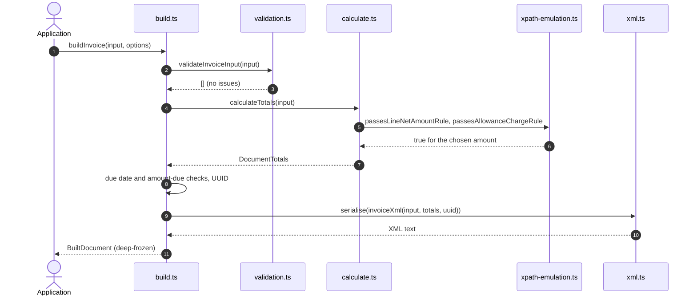

**Failure and error paths.**

| # | What goes wrong | Detected in | What the system does | State left behind | Recovery |
| --- | --- | --- | --- | --- | --- |
| 1 | The input breaks one or more rules (for example a TRN ending in 04, `subdivision: 'Dubai'`, unit code `PCS`) | `validateInvoiceInput` | Throws `InvoiceInputError`; `issues` holds every problem; the message starts `3 problems in the document input:` with lines such as `  - seller.trn: must be 15 digits, start with 1 and end with 03 [ibr-132-ae]` | Nothing built | Fix the fields named by `path`; the rule ID identifies the official rule |
| 2 | Input is not an object (loosely typed caller) | `validateInvoiceInput` | Issue `INVALID_INPUT` at path `''`: "the invoice input must be an object" | Nothing built | Pass an object |
| 3 | A full card number in `paymentMeans[].card.primaryAccountNumberId` (careless or tampered input) | `validatePaymentMeans` | Issue `CARD_NUMBER_NOT_MASKED` | Nothing built; the number never reaches the XML | Pass the last four digits, optionally masked, for example `XXXXXXXXXXXX1234` |
| 4 | A character XML 1.0 cannot carry, or a blank text field | `text()` in `validation.ts` | Issues `INVALID_CHARACTER` or `EMPTY` (ibr-079) | Nothing built | Clean the text |
| 5 | Category N or the profit margin scheme | `validateLine`, `validateCommon`, `validateDocumentAllowanceCharge` | Issue `UNSUPPORTED` for a line in category N or the profit margin flag; `NOT_ALLOWED` (ibr-114-ae for a charge, ibr-115-ae for an allowance) for a document-level item in category N | Nothing built | Not supported in this version ([ADR-005](docs/decisions.md#adr-005-vat-rates-are-fixed-by-the-category-category-n-is-not-supported)); planned (FR-21) |
| 6 | The amounts cannot satisfy the rules: per-line VAT drifts more than 0.02 (`VAT_ROUNDING_DRIFT`, aligned-ibrp-s-09), no neighbour of a half-fil tie passes (`LINE_AMOUNT_ROUNDING`, ibr-147-ae), an explicit amount differs from base × percent (`ALLOWANCE_CHARGE_MISMATCH`), allowances exceed a line or a category (`NEGATIVE_LINE_AMOUNT`, `NEGATIVE_TAXABLE_AMOUNT`), a result exceeds `Number.MAX_SAFE_INTEGER` (`AMOUNT_TOO_LARGE`) | `calculateTotals` throws `CalculationError` | `calculateOrThrow` re-throws it as an `InvoiceInputError` with one issue carrying the code and rule; the issue's `path` is set only for `standardRatedVat`, `NOT_APPLICABLE` and the `AMOUNT_TOO_LARGE` cases of line and allowance amounts, otherwise it is `''` and the message names the field where there is one (for example `lines[0]: line allowances exceed the line amount`) | Nothing built | For drift, use `vatRounding: 'category'`; otherwise change the quantity, price, base quantity or allowance |
| 7 | An amount is due but there is no due date | `buildInvoice` follow-up | `InvoiceInputError`: `REQUIRED` at `dueDate`, rule ibr-127-ae | Nothing built | Add `dueDate`, or record the payment as `prepaidAmount` |
| 8 | Prepaid amount above the total | `buildInvoice` follow-up | `NEGATIVE_AMOUNT_DUE` at `prepaidAmount`: "the prepaid amount exceeds the invoice total; issue a credit note instead" | Nothing built | Correct `prepaidAmount` |
| 9 | The caller tries to change the returned document | JavaScript engine (object frozen by `deepFreeze`) | The assignment throws `TypeError` in strict-mode code such as ES modules, and has no effect otherwise | Document unchanged, so its totals cannot drift from its XML | Build a new document from changed input |

### 5.2 Issue a document in the ledger

**Trigger and actors.** The application calls `ledger.issue(built)` on a `DocumentLedger`. Actors: application, `DocumentLedger`, `issueDocument`, the `DocumentStore`.

**Preconditions.** A `BuiltDocument` from `buildInvoice` or `buildCreditNote`. A ledger, by default over an `InMemoryDocumentStore`.

**Happy path.**

1. `issue` appends the call to the ledger's queue; it starts when earlier calls on the same ledger have settled.
2. The ledger computes `documentHash(built.xml)` and calls `store.get(built.id)`, which returns nothing.
3. `issueDocument(built)` runs `assertMatchesXml` (document type, number, UUID, issue date, type code, currency, total with VAT and line quantities must equal the XML), records `sha256` of the UTF-8 bytes and `issuedAt` (ISO 8601), extracts `creditedInvoiceIds` (empty for an invoice) and deep-freezes the record.
4. For a credit note the ledger runs its credit check (5.3, steps 8 to 9).
5. `store.insert(issued)` stores the record; the in-memory store refuses an existing number.
6. `issue` resolves with the `IssuedDocument`. Later, `ledger.get(id)` re-checks the fingerprint with `assertUnmodified`, and `ledger.verify(id, xml?)` returns whether the stored XML (and, if given, the passed XML) still matches.

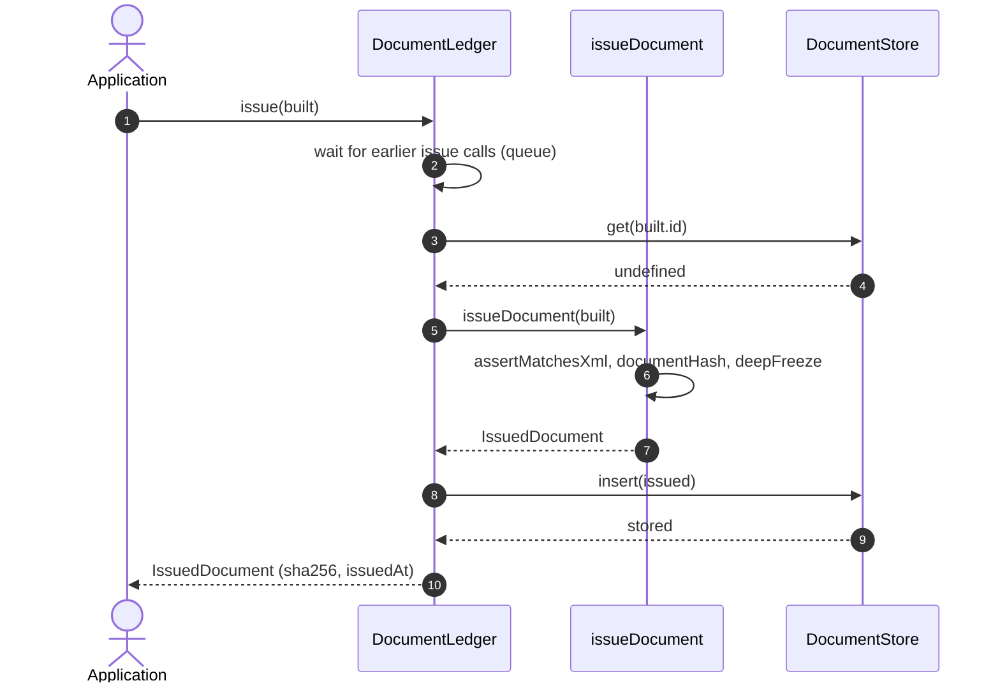

**Failure and error paths.**

| # | What goes wrong | Detected in | What the system does | State left behind | Recovery |
| --- | --- | --- | --- | --- | --- |
| 1 | The same document is issued again (a retry, or two concurrent calls with identical content) | `DocumentLedger` (hash equal to the stored one) | Returns the stored record; concurrent calls run one after the other and both get the same object | Unchanged | None needed: issuing is idempotent |
| 2 | A different document under an issued number | `DocumentLedger` (hash differs) | Rejects with `ImmutableDocumentError`: `<kind> <id> was issued on <issuedAt> and cannot be changed. Issue a credit note to correct it (see creditNoteFor).`, where `<kind>` is `Invoice` or `CreditNote` | Original unchanged | Issue a credit note; for a document the provider rejected, issue the correction under a new number (5.6) |
| 3 | A record whose fields disagree with its XML (assembled or altered outside the builder) | `assertMatchesXml` | Rejects with `EInvoiceError`: `Document <id> cannot be issued: its <fields> differ from its XML` | Nothing stored | Issue the unchanged output of the builder |
| 4 | An attempt to edit or delete an issued document | `DocumentLedger.update`, `delete` | Rejects with `ImmutableDocumentError`: `Document <id> has been issued and cannot be edited. Issue a credit note to correct it.` (or `cannot be deleted. Issue a credit note to reverse it.`) | Unchanged | Issue a credit note |
| 5 | Stored XML was altered (tampering in storage) | `DocumentLedger.get` through `assertUnmodified`; `verify` | `get` rejects with `ImmutableDocumentError`: `Document <id> does not match its SHA-256 fingerprint <sha256>; it was changed after issue`; `verify` returns `false` | The altered record stays in the store | Restore the record from a trusted copy and investigate; the fingerprint shows which bytes were issued |
| 6 | The store refuses or fails the insert (`Document <id> already exists` at store level, or an error from a custom store such as a lost database connection) | `DocumentStore.insert` | The rejection reaches the caller; the queue carries on with the next call | Not stored, provided the store's insert is atomic | Retry `issue`: it is idempotent |
| 7 | Several processes or ledger objects share one store | Not detected by the ledger | The queue only serialises calls on one ledger object, so two processes can both pass the number check | Possible duplicate or race at the store | Use a store that enforces uniqueness and the credit cap atomically (planned PostgreSQL store, section 7) |

### 5.3 Correct an invoice with a credit note

**Trigger and actors.** The application corrects an issued invoice, wholly or in part. Actors: application, `DocumentLedger`, `creditNoteFor`, `buildCreditNote`, the `DocumentStore`.

**Preconditions.** The invoice is issued in the same ledger. The application still has the original `InvoiceInput`. The credit note date is not before the invoice date. No other credit note for the same invoice is being prepared at the same time, because steps 1 to 9 are not one atomic operation (failure row 13).

**Happy path.**

1. The application reads `alreadyCredited = await ledger.creditedQuantities(invoice.id)`; the ledger sums the line quantities of credit notes that reference only this invoice (from `store.list()`).
2. It calls `creditNoteFor(originalInput, invoice, { id, issueDate, reason, lines?, alreadyCredited })`.
3. `creditNoteFor` checks that the issued document is an invoice with the same number, that the date is not earlier, and that `calculateTotals(originalInput)` reproduces the issued total.
4. `planLines` checks the requested lines and quantities against what remains (invoiced minus `alreadyCredited`).
5. For a whole credit, lines and document-level items are copied. For a partial credit, each line is pro-rated on the cumulative quantity, document-level items and the S VAT follow the credited share, and any rounding residual becomes an allowance or charge with reason "Rounding difference to the invoiced amount".
6. The type code is 381, or 81 when the invoice is a 480 or only E and O lines are credited; `precedingInvoices` references the invoice number and date.
7. `buildCreditNote(creditNoteInput)` validates (including `standardRatedVat` within 0.02, aligned-ibrp-s-09) and builds the XML (5.1).
8. `ledger.issue(built)` runs the steps of 5.2; for a credit note the private credit check confirms that it references exactly one invoice that is in the ledger, in the same currency, not dated before it.
9. The check adds `creditedAmount(invoiceId)` to the credit note's total with VAT and compares it with the invoice total; within the cap the credit note is inserted and returned.

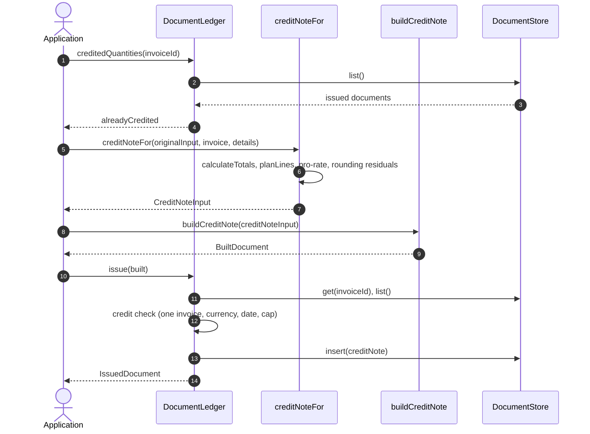

**Failure and error paths.**

| # | What goes wrong | Detected in | What the system does | State left behind | Recovery |
| --- | --- | --- | --- | --- | --- |
| 1 | The credit would take the credited total above the invoice total | Ledger credit check | Rejects with `OverCreditError`: `Credit note would credit <n> minor units against invoice <id>, which totals <t> and already has <a> credited` | Credit note not stored | Credit less, or nothing if already credited in full |
| 2 | Two credit notes for one invoice are issued concurrently through one ledger | Ledger queue, then the credit check | The second call starts only after the first is stored, so it sees the new credited amount and gets `OverCreditError` if it would exceed the cap (tested with three concurrent full credits) | Only credit notes within the cap are stored | None needed for the total cap; per-line quantities are not checked (row 13). Across several processes the cap is not enforced by the in-memory store (5.2, row 7) |
| 3 | The quantity to credit exceeds what remains on a line | `planLines` in `creditNoteFor` | `EInvoiceError`: `Line <n> of invoice <id> was invoiced with quantity <q> and <c> has already been credited; <r> cannot be credited` | Nothing built | Pass the current `alreadyCredited` and a smaller quantity |
| 4 | The invoice was already credited in full and `lines` is `'all'` | `planLines` | `EInvoiceError`: `Invoice <id> has already been credited in full` | Nothing built | Nothing left to credit |
| 5 | Unknown line, a line listed twice, or an empty list | `planLines` | `Invoice <id> has no line <n>`, `Line <n> is listed twice; credit each line once`, `List at least one line to credit, or pass lines: "all"` | Nothing built | Correct `details.lines` |
| 6 | The original input no longer reproduces the issued invoice (edited input, or the wrong one) | `creditNoteFor` | `EInvoiceError`: `The input does not reproduce invoice <id>: its totals differ from the issued document`, or `The input is for <a> but the issued invoice is <b>` | Nothing built | Use the input the invoice was built from |
| 7 | The credit note is dated before the invoice | `creditNoteFor`; again in the ledger | `The credit note date <d> is before the invoice date <e>`; the ledger refuses a hand-built one with `Credit note <id> is dated <d>, before invoice <inv> (<e>)` | Nothing stored | Use a date on or after the invoice date |
| 8 | The referenced invoice is not in the ledger, or is a credit note | Ledger credit check | `EInvoiceError`: `Credit note <id> references invoice <inv>, which is not in the ledger` | Not stored | Issue the invoice in this ledger first |
| 9 | A credit note references several invoices, or a different currency | Ledger credit check | `Credit note <id> references <n> invoices (…). The ledger can only check a credit note against one invoice; issue one credit note per invoice.` or `Credit note <id> is in <c1> but invoice <inv> is in <c2>` | Not stored | One credit note per invoice, in the invoice's currency |
| 10 | A volume discount (VD) credit note references an invoice | `validateCreditNoteInput` | `NOT_ALLOWED` at `precedingInvoices`, rule ibr-055-ae | Nothing built | Leave out the reference ([ADR-016](docs/decisions.md#adr-016-volume-discount-credit-notes-follow-the-published-rule-not-the-bis-text)); `creditNoteFor` does not accept VD |
| 11 | A hand-written `standardRatedVat` differs from taxable amount × 5 % by more than 0.02 | `calculateTotals` | `InvoiceInputError` with `VAT_ROUNDING_DRIFT`, rule aligned-ibrp-s-09, path `standardRatedVat` | Nothing built | Let `creditNoteFor` compute it |
| 12 | A credit note against an invoice the provider rejected | Not detected: the ledger does not record delivery status | The ledger would accept it | A credit note for a document that was never delivered | The application must not issue one; replace the rejected invoice under a new number (5.6) |
| 13 | A line is credited beyond its invoiced quantity because `alreadyCredited` was stale or omitted (two partial credit notes built from the same `creditedQuantities` result, or a caller that does not pass it) | Not detected: the ledger caps only the credited total with VAT (`#checkCredit`), and `creditedQuantities` is read outside the issue queue | Both credit notes are stored while their combined total stays within the invoice total ([ADR-019](docs/decisions.md#adr-019-partial-credit-notes-are-pro-rated-on-the-cumulative-credited-quantity): a credit note built another way is held only to the cap on the total) | The line is over-credited; the next `creditNoteFor` for the invoice throws `alreadyCredited.<line> is <n>, but line <line> of invoice <id> was invoiced with quantity <q>` | Serialise `creditedQuantities` → `creditNoteFor` → `issue` per invoice in the application; an issued over-credit cannot be withdrawn and must be corrected by the seller |

### 5.4 Submit a document to the provider and read its status

**Trigger and actors.** The application submits an issued document. Actors: application, `HttpAspClient`, the provider (in this repository `MockAspServer`).

**Preconditions.** An `IssuedDocument`; the provider's base URL (https unless on this machine) and API key; optionally a callback URL. The mock must be listening (tests, `npm run mock-asp` or `npm run example:submit`).

**Happy path.**

1. The application constructs `new HttpAspClient({ baseUrl, apiKey, callbackUrl?, timeoutMs?, retry? })`; the constructor checks the URL scheme, the key and the whole-number options.
2. It calls `client.submit(toSubmission(issued))`; `toSubmission` maps `id`, `kind`, `xml` and `sha256` to a `SubmissionRequest`.
3. The client sets `authorization`, `idempotency-key` (the document number, percent-encoded), `x-document-sha256`, `x-document-type`, `content-type` and, if configured, `x-callback-url`, and checks that the headers and URL can be built.
4. Attempt 1: `POST /v1/submissions` with a per-attempt timeout (default 10 s) combined with the caller's `signal`.
5. The mock checks the API key, takes no fault, checks the content type, decodes the key, checks the callback host, reads the body (at most 5 MiB) and compares its SHA-256 with `X-Document-SHA256`.
6. The key is new: the mock stores the submission as `received` and answers 202 with `{ submissionId, invoiceId, status, receivedAt }`.
7. The client reads and parses the body within the same attempt and returns a `SubmissionReceipt` with `attempts: 1` and `replayed: false`.
8. After `processingDelayMs` the mock applies `decide(xml)` and sets `accepted` (or `rejected` with errors); with a callback URL it sends the signed callback (5.5).
9. The application reads the status with `getStatus(submissionId)` or `waitForFinalStatus(submissionId, { intervalMs, timeoutMs })`, which polls `GET /v1/submissions/{id}` (default every 1000 ms for up to 60 000 ms) until the status is no longer `received`.
10. The application stores the receipt and the final report in its own submission records; the ledger is not changed ([ADR-020](docs/decisions.md#adr-020-a-rejected-document-is-replaced-under-a-new-number)).

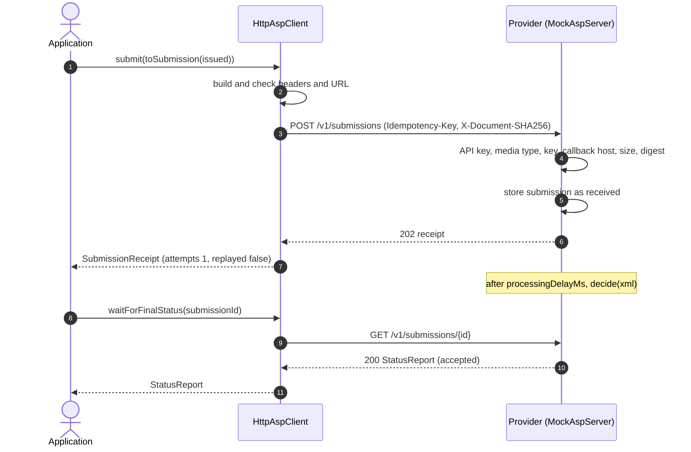

**Failure and error paths.**

| # | What goes wrong | Detected in | What the system does | State left behind | Recovery |
| --- | --- | --- | --- | --- | --- |
| 1 | Plain http to a host that is not this machine (would expose the API key) | `HttpAspClient` constructor (`checkedUrl`) | `TypeError`: `baseUrl must use https for a host that is not this machine (<host>): plain http would expose the API key and the documents. Set allowInsecureHttp only in a test set-up.` (same for `callbackUrl`) | No client, nothing sent | Use https |
| 2 | Missing or unsendable API key; option out of range | Constructor | `TypeError` `apiKey is required` or `apiKey contains characters that cannot be sent in an HTTP header`; `RangeError` `<option> must be a whole number from <min> to <max> (got <value>)` | No client | Fix the configuration |
| 3 | Unauthenticated: wrong or missing API key | Mock (before any fault is used) | 401 `UNAUTHORISED` "Missing or wrong API key"; the client does not retry and throws `AspRequestError` (`status` 401) | Nothing stored | Correct the key. The mock has no other permission model, so there is no 403 case |
| 4 | Callback URL on a host the provider does not allow | Mock | 400 `CALLBACK_URL_NOT_ALLOWED`; `AspRequestError` | Nothing stored | Use an allowed callback host, or configure `callbackHosts` in tests |
| 5 | Tampered or mismatched body (digest differs) | Mock | 400 `DIGEST_MISMATCH` "X-Document-SHA256 does not match the body"; `AspRequestError` | Nothing stored | Submit the issued record unchanged (`toSubmission`) |
| 6 | Wrong media type, missing or malformed idempotency key, body too large | Mock | 415 `UNSUPPORTED_MEDIA_TYPE`, 400 `IDEMPOTENCY_KEY_REQUIRED` or `IDEMPOTENCY_KEY_INVALID`, 413 `TOO_LARGE`; `AspRequestError`, not retried | Nothing stored | Fix the request; `HttpAspClient` always sends a valid key and media type |
| 7 | A request that cannot be built (for example a header value fetch refuses) | `#send`, before the first attempt | `AspRequestError` with `status` undefined: `POST /v1/submissions cannot be sent: …`; no attempt is made | Nothing sent | Fix the input |
| 8 | Network error, dropped connection, attempt timeout, or HTTP 408, 425, 429, 500, 502, 503, 504 | `#send` | Retries after a random delay in [0, min(`maxDelayMs`, `baseDelayMs` × 2^(n−1))), or after `Retry-After`; `onRetry` reports each retry | Possibly stored by the provider on an earlier attempt | None needed when a later attempt succeeds |
| 9 | Lost response: the provider stored the submission but the answer failed | Next attempt reaches the mock with the same key and digest | 200 with `idempotent-replayed: true`; the receipt has `replayed: true`, and the provider holds one submission | One submission | None needed (shown by `npm run example:submit`) |
| 10 | `Retry-After` longer than `retry.maxDelayMs` | `#send` | Stops at once with `AspUnavailableError` carrying `retryAfterMs`: `POST /v1/submissions: the provider asked to retry after <s> s, longer than retry.maxDelayMs (<n> ms); retry later` | Unknown at the provider | Schedule a retry after `retryAfterMs`; resubmitting is safe |
| 11 | Every attempt fails | `#send` | `AspUnavailableError`: `POST /v1/submissions failed after <n> attempts: <last error>` | Unknown at the provider | Retry later with the same document; the idempotency key prevents a duplicate |
| 12 | The same number with different content (idempotency conflict) | Mock | 409 `IDEMPOTENCY_CONFLICT` "Document <id> was already submitted with different content"; `AspConflictError` | The first submission stays | A number means one document; issue a new number for corrected content (5.6). The ledger already refuses this case (5.2, row 2) |
| 13 | A success response that is not JSON, is JSON but not an object, lacks a field or has an unknown status | `#send`, `requireString`, `readStatus` | `AspRequestError` `Provider returned a response that is not JSON (HTTP <n>)` or `Provider returned an unexpected response (HTTP <n>)`; `AspError` `Provider response has no <field>` or `Provider returned an unknown status: <value>` | Possibly stored by the provider | Check the provider API; resubmitting is safe |
| 14 | The caller aborts | `signal` | Ends the current attempt or sleep and throws the abort reason; no further attempts | Unknown at the provider | Resubmit later |
| 15 | Status still `received` when polling ends | `waitForFinalStatus` | `AspError`: `Submission <id> is still being processed` | Submission still processing | Poll again later or wait for the callback |
| 16 | Unknown submission id | Mock | 404 `NOT_FOUND` "Unknown submission"; `AspRequestError` | Unchanged | Use the `submissionId` from the receipt |
| 17 | Unexpected exception inside the mock | Mock request handler | 500 if no header was sent yet; the client retries it | Possibly partly processed | Retries cover it; investigate the mock |

### 5.5 Receive a signed status callback

**Trigger and actors.** The provider finishes processing a submission that carried a callback URL. Actors: provider (`MockAspServer`), the application's HTTP server with `createCallbackHandler`, `verifyCallback`, the application's `onReport`.

**Preconditions.** The application listens with `createCallbackHandler({ secret, onReport })`; the provider signs with the same secret; the clocks differ by less than the tolerance (300 s).

**Happy path.**

1. The provider serialises the `StatusReport`, takes the current Unix time and signs `<timestamp>.<body>` with HMAC-SHA256 (`signCallback`).
2. It sends `POST <callback URL>` with `x-asp-signature: sha256=<hex>`, `x-asp-timestamp` and the JSON body (5-second timeout).
3. The handler accepts only POST and reads the body up to `maxBodyBytes` (64 KiB by default).
4. `verifyCallback` checks that both headers are present, that the timestamp is digits and within 300 seconds of now, compares the signature in constant time, parses the JSON and checks the report's shape.
5. The handler forgets expired signatures, finds this one is new and records it with its outcome and expiry.
6. It calls `onReport(report)`; when that resolves, it answers 204.
7. The provider records the delivery (`callbackDeliveries` on the mock) and stops.

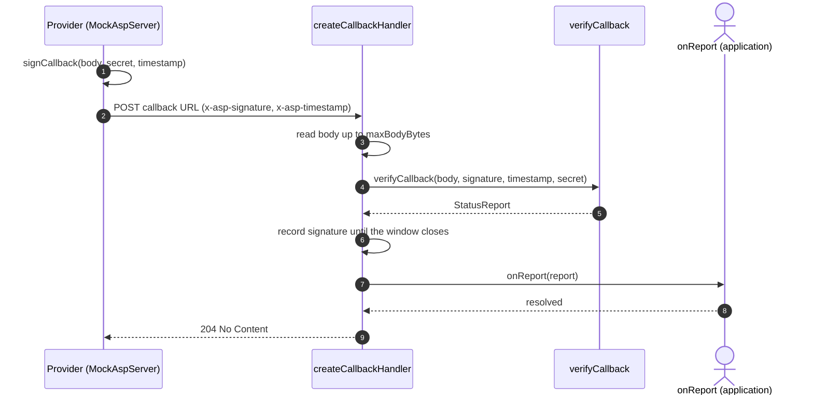

**Failure and error paths.**

| # | What goes wrong | Detected in | What the system does | State left behind | Recovery |
| --- | --- | --- | --- | --- | --- |
| 1 | Unauthenticated or tampered callback: missing headers, non-numeric timestamp, wrong signature (other secret or changed body), body not JSON or not a status report | `verifyCallback` (`CallbackVerificationError`) | 401 with no detail; `onReport` not called | Nothing recorded | The provider retries (the mock up to 3 attempts, 50 ms × attempt apart); fix the shared secret |
| 2 | Replay of a captured callback after the window | `verifyCallback` | 401 with no body (`verifyCallback` throws `CallbackVerificationError` "Callback timestamp is outside the accepted window" internally) | Nothing recorded | None needed; check the clocks if genuine callbacks fail |
| 3 | Exact replay inside the window | Handler's signature map | Same answer as the first delivery, without calling `onReport` again | Report handled once | None needed |
| 4 | A repeat arrives while `onReport` is still running for the first delivery | Handler's signature map | Waits for the first outcome and answers the same (204 or 500) | Report handled once | None needed |
| 5 | `onReport` throws or rejects (for example the application's database is down) | Handler | 500; the signature is forgotten so a redelivery is handled again | Report not stored | The provider redelivers; `onReport` must be idempotent |
| 6 | Body larger than `maxBodyBytes` | Handler | 413 with `connection: close`; stops reading and closes the connection | Nothing recorded | Provider-side issue; raise `maxBodyBytes` only if reports are legitimately larger |
| 7 | Method other than POST | Handler | 405 with `allow: POST` | Nothing recorded | Use POST |
| 8 | The receiver is down or answers non-2xx | Mock `#deliver` | Records the delivery as `network-error` or the status and retries up to 3 attempts | Report not delivered | Poll with `getStatus` (5.4, step 9) |
| 9 | The same report arrives with a fresh signature, or at another process behind a load balancer | Not detected (memory is per handler) | `onReport` is called again | Duplicate report | `onReport` must be idempotent, for example keyed by `submissionId` and `status` |

### 5.6 Replace a rejected document under a new number

**Trigger and actors.** The provider rejects a submitted document, for example because its own checks fail or the buyer cannot be reached. Actors: application, `DocumentLedger`, `HttpAspClient`, provider.

**Preconditions.** The rejected document is issued in the ledger and was submitted (5.4).

**Happy path** ([ADR-020](docs/decisions.md#adr-020-a-rejected-document-is-replaced-under-a-new-number)).

1. `waitForFinalStatus` (or a callback) returns `status: 'rejected'` with `errors`, for example `DEMO-BUYER-NOT-FOUND` in `npm run example:submit`.
2. The application stores the rejection report next to the document in its own records. The rejected document stays in the ledger, issued and unchanged; its number stays used.
3. The application corrects the input and builds the document again under a new number (and a new UUID).
4. `ledger.issue` stores the replacement (5.2).
5. `client.submit` sends it under the new idempotency key (5.4); the provider accepts it.

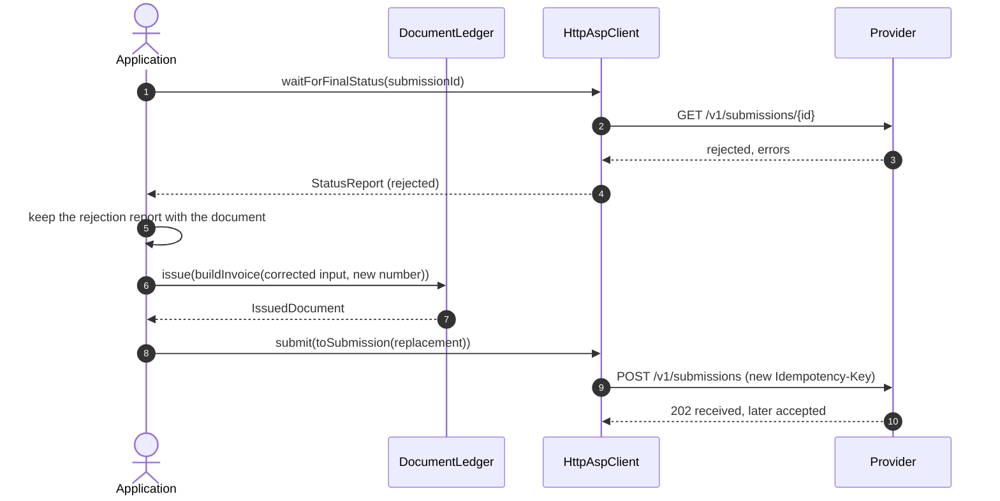

**Failure and error paths.**

| # | What goes wrong | Detected in | What the system does | State left behind | Recovery |
| --- | --- | --- | --- | --- | --- |
| 1 | The corrected document is issued under the rejected number | `DocumentLedger.issue` | `ImmutableDocumentError` (5.2, row 2) | Rejected document unchanged | Use a new number |
| 2 | The corrected content is submitted under the old number to a provider that kept the first | Provider | 409 `IDEMPOTENCY_CONFLICT`; `AspConflictError` | Provider keeps the rejected submission | Use a new number |
| 3 | A credit note is issued against the rejected invoice | Not detected (5.3, row 12) | Accepted by the ledger | A credit note for an undelivered document | Application rule: never credit a rejected document |
| 4 | The replacement is rejected too | Provider | Same as step 1 | Two rejected numbers | Repeat with another number after fixing the cause; each rejection leaves a gap in the number sequence, a question for the seller's tax adviser or provider |

### 5.7 Validate documents with the official artefacts

**Trigger and actors.** A developer runs `npm run conformance` (or `npm run validator:build` then `npm run test:conformance`), or the CI `conformance` job runs. Actors: `scripts/fetch-artefacts.ts`, official sources, Docker, Vitest, `scripts/lib/validator-client.ts`, the `Validator` in the container.

**Preconditions.** Docker running; network access for the first download (later runs reuse verified files in `validator/.artefacts/`); on Windows a short clone path (esbuild cannot start from a path over 260 characters; see the [README](README.md#running-the-tests)).

**Happy path.**

1. `npm run artefacts:fetch` reads `validator/artefacts.lock.json`. For each file it reuses the cached copy when its SHA-256 matches; otherwise it downloads it (60 s timeout, 3 attempts) and verifies it.
2. It extracts the six listed folders of the PINT AE archive, places 16 UBL schema files and 3 jars, and writes `MANIFEST.json`.
3. `docker build --tag einvoice-ae-validator:local validator` compiles `Validator.java` with `-Xlint:all -Werror` and copies the verified files; apart from pulling the two digest-pinned Temurin base images the first time, the build needs no network.
4. `npm run test:conformance` starts Vitest with `vitest.conformance.config.ts` (300 s timeouts). `official-validation.test.ts` checks the artefacts exist and calls `runValidator` once for every manifest file plus the 30 official examples.
5. `property-validation.test.ts` builds 80 seeded random invoices (seed 20260927), splits each into partial credit notes through a ledger, writes them to `out/property/` and validates the folder.
6. In the container, for each file: secure parse, root element, XSD, then the `pint` and `pint-ae` layers; findings are written as JSON; the exit code is 0 or 1.
7. The tests compare `fatalRuleIds` with `expectedRules` in `corpus/manifest.json` (none for valid and gap documents, exactly one rule for each broken document, the documented findings for observations); every official example passes except the known XSD failure of `Volume-discount-credit-note.xml`; the seeded documents have no finding at all.
8. In CI, `scripts/validate.ts --json` writes `validation-report.json`, uploaded as the `validation-report` artefact.

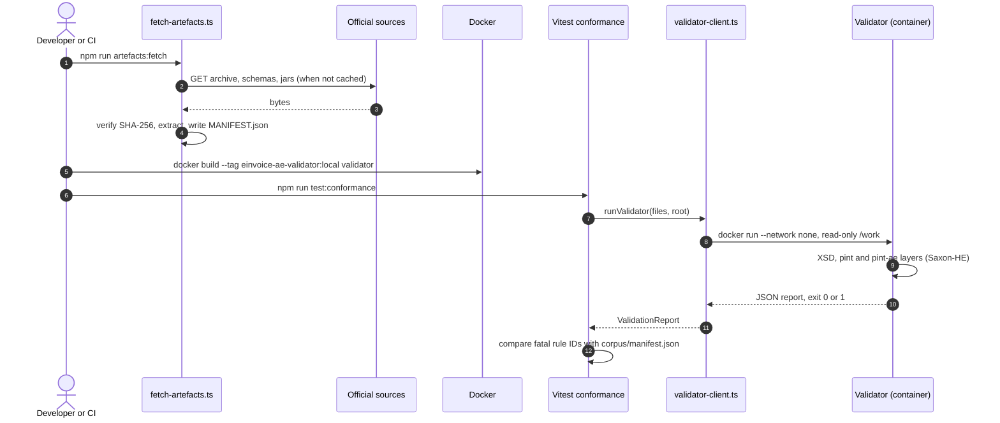

**Failure and error paths.**

| # | What goes wrong | Detected in | What the system does | State left behind | Recovery |
| --- | --- | --- | --- | --- | --- |
| 1 | Tampered or replaced upstream file (the resources URL has no version) | `verifyChecksum` | `ChecksumMismatchError`: `Checksum mismatch for <url>` with the expected and actual hash and the advice to review and update the lock file; exit 1 | The bad file is not written; earlier verified files remain | Follow [Updating to a new release](docs/validation-artefacts.md#updating-to-a-new-release) |
| 2 | Network failure or HTTP error while downloading | `httpFetcher` | Three attempts with a 60 s timeout each, waiting 1, 2 and 3 s after the failures; then `Download failed after 3 attempts: <url>`; exit 1 | Files verified so far remain | Retry when the source is reachable; CI uses its cache |
| 3 | An archive entry that would escape the output folder, an encrypted or ZIP64 entry, or a corrupt archive | `safeJoin`, `readZip` | `Refusing to write outside <root>: <entry>`, `Encrypted ZIP entries are not supported (…)`, `ZIP64 entries are not supported (…)`, `Corrupt ZIP: …`; exit 1 | Nothing written for that entry | Investigate the archive; never relax the check |
| 4 | Docker is not installed or not running | `runValidator` | `Could not start docker: <message>` when the `docker` command cannot be started; when the daemon is down, `Validator container exited with code <n>. …` or `Could not parse validator output: …` | No report | Install or start Docker Desktop |
| 5 | The image was not built | `runValidator` (exit code other than 0 or 1) | `Validator container exited with code <n>. … Build the image first with: npm run validator:build (image einvoice-ae-validator:local)` | No report | `npm run validator:build` |
| 6 | Artefacts missing when the conformance tests start | `official-validation.test.ts` | `` Validation artefacts are missing. Run `npm run validator:build` before `npm run test:conformance`. `` | No report | `npm run validator:build` |
| 7 | A document with a DOCTYPE (XXE attempt) or not well-formed | `Validator.secureReader` | Result `error: "Not well-formed XML: …"`, `valid: false`; no external entity is resolved | Report lists the file as invalid | Fix the document |
| 8 | Root is not a UBL 2.1 Invoice or CreditNote | `Validator.validate` | Result error `Root element must be a UBL 2.1 Invoice or CreditNote` | Invalid in the report | Validate only UBL documents |
| 9 | A Schematron layer fails at run time | `Validator.validate` | Result error `Schematron layer <name> failed: …` | Invalid in the report | Investigate the artefacts or Saxon version |
| 10 | Start-up failure (artefacts missing in the image, file not found, stylesheet does not compile) | `Validator.main` | Exit 2 with `Validator start-up failed: …`; the client reports the exit code | No report | Rebuild the image; check the paths |
| 11 | A file outside the repository root | `dockerArguments` | `<file> is outside the repository root <root>` | No container started | Validate files inside the repository |
| 12 | The library produced a document with an unexpected finding | Vitest assertion | Test fails and lists the rule IDs | Report available for inspection; seeded documents stay in `out/property/` | Reproduce with `npm run validate -- out/property/<file>` and fix the library or corpus |
| 13 | Upstream files change while CI holds a verified cache | `artefacts.yml` job `upstream` | That scheduled job fails; pull-request CI keeps passing with the cached files ([ADR-007](docs/decisions.md#adr-007-validation-artefacts-are-downloaded-and-pinned-not-committed)); see 5.11 | Lock file now stale | Review the release and update the lock file |
| 14 | Scheduled workflows disabled after 60 days without activity | GitHub | `artefacts.yml` stops running (5.11, row 4) | No upstream watch; cache may expire after 7 days unused | Re-enable the workflow |

### 5.8 Keep code lists and the corpus in step

**Trigger and actors.** CI (`conformance` and `test` jobs) or a developer runs the drift checks. Actors: `scripts/sync-codelists.ts`, `scripts/generate-corpus.ts`, the library, the committed files.

**Preconditions.** For code lists, the artefacts are in `validator/.artefacts/` (5.7, steps 1 to 2). For the corpus, only Node.js.

**Happy path.**

1. `npm run codelists:sync -- --check` parses `PINT-UBL-validation-preprocessed.sch` and `PINT-jurisdiction-aligned-rules.sch`, reads the test of each of the 13 listed rules, extracts the codes and renders `generated.ts` in memory.
2. The rendered text equals the committed `src/codelists/generated.ts`: it prints `Code lists are up to date.`
3. `test/unit/codelists.test.ts` confirms the hand-kept lists in `src/codelists/pint-ae.ts` have the same codes.
4. `npm run corpus:generate -- --check` calls `generateCorpus()`, compares every generated file with the committed one and looks for committed XML that is no longer generated.
5. Everything matches: it prints `Corpus is up to date (69 documents).`

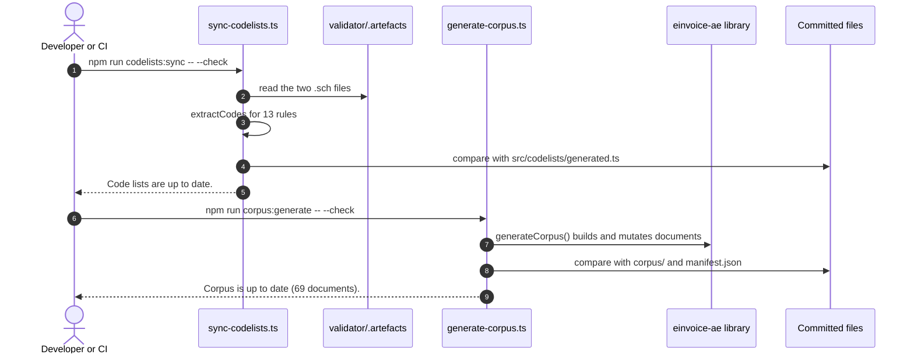

**Failure and error paths.**

| # | What goes wrong | Detected in | What the system does | State left behind | Recovery |
| --- | --- | --- | --- | --- | --- |
| 1 | The official code lists changed | `sync-codelists.ts --check` | `` src/codelists/generated.ts is out of date. Run `npm run codelists:sync` and commit the result. ``; exit 1 | Committed file unchanged | Run the sync, review the diff, update `pint-ae.ts` if `codelists.test.ts` fails |
| 2 | A listed rule is gone or its test no longer holds a list | `assertTest`, `extractCodes` | `Rule <id> not found in the Schematron` or `No code list found in test: …`; exit 1 | Unchanged | Update `LISTS` after reviewing the new release |
| 3 | Artefacts not downloaded | `readFile` in `sync-codelists.ts` | The file-not-found message; exit 1 | Unchanged | `npm run artefacts:fetch` |
| 4 | The library's output changed but the corpus was not regenerated | `generate-corpus.ts --check`; `test/unit/corpus.test.ts` | `<path> is out of date` (or `is missing`, `is not generated any more`), then `` Run `npm run corpus:generate` and commit the result. ``; exit 1 | Committed corpus unchanged | Regenerate, review the XML diff, commit |
| 5 | A mutation no longer applies to the regenerated valid document | `corpus/mutate.ts`, `generateCorpus` | `Expected exactly one occurrence of "…", found <n>` or `Broken case <rule> did not change the document` | Nothing written | Update the mutation in `corpus/broken.ts`, `gaps.ts` or `observations.ts` |

### 5.9 Map a TopFlow Hub order to an invoice

**Trigger and actors.** `npm run example:topflow`, or a test calling the exported functions. Actors: `mapTopFlowOrderToInvoice`, `resolveListPrices`, `buildInvoice`, `reconcile`.

**Preconditions.** A delivered B2B order in TopFlow Hub's shape, a seller, the buyer's Peppol endpoint (TIN) and licence authority (not stored by TopFlow Hub), and a payee account. All demo data is made up.

**Happy path.**

1. `mapTopFlowOrderToInvoice` checks status `DELIVERED`, currency AED, VAT rate 500 basis points, channel `B2B`, not refunded, an organisation with a legal name.
2. It takes the buyer address from `options.buyerAddress` or the structured delivery address (emirate mapped with the example's `EMIRATE_CODES`).
3. `resolveListPrices` uses the quotation list prices when given (checked against the stored unit price), otherwise recovers them from TopFlow Hub's discount formula, settling ambiguous lines with the stored discount total.
4. It maps units (`UNIT_CODES`), the payment method (UNCL 4461 code 30, 48 or 10), the due date from the payment terms (none when paid), the delivery fee as an S charge, and sets `vatRounding: 'line'`.
5. `buildInvoice` builds the invoice (5.1).
6. `reconcile` compares 15 stored amounts (net and VAT of each of the 5 lines, subtotal, discount total, delivery fee, VAT, total) with the invoice; all match.
7. The script prints the table and writes `examples/output/topflow-order.xml`.

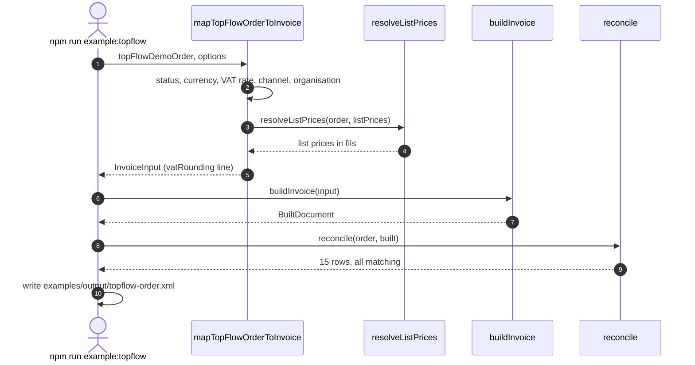

**Failure and error paths.**

| # | What goes wrong | Detected in | What the system does | State left behind | Recovery |
| --- | --- | --- | --- | --- | --- |
| 1 | Order not delivered, or cancelled | `mapTopFlowOrderToInvoice` | `Order <n> is <status>; this example invoices delivered orders only` or `Order <n> was cancelled; there is nothing to invoice` | Nothing built | Invoice after delivery |
| 2 | Not AED, not 500 bps, retail, or refunded | `mapTopFlowOrderToInvoice` | An `Error` naming the order and the reason, for example `Order <n> was refunded; invoice it only with a matching credit note, not from this mapping` | Nothing built | Outside this mapping's scope |
| 3 | No organisation, or no legal name | `mapTopFlowOrderToInvoice` | `Order <n> has no organisation; a B2B invoice needs the buyer`; `Organisation "<name>" has no legal name (IBT-044); complete its verification in TopFlow first` | Nothing built | Complete the master data |
| 4 | Only a free-text shipping address | `mapTopFlowOrderToInvoice` | `Order <n> has only a free-text shipping address ("…"); pass options.buyerAddress with the emirate` | Nothing built | Pass `buyerAddress` |
| 5 | Delivery address outside the UAE | `snapshotAddress` | `Order <n> has a delivery address in <country>; TopFlow addresses are in the UAE` | Nothing built | Check the order data |
| 6 | No payment method | `paymentMeansFor` | `Order <n> has no payment method; an invoice needs one (ibr-191-ae)` | Nothing built | Record the payment method |
| 7 | List prices cannot be recovered exactly, or a given list price does not give the stored unit price | `resolveListPrices` | `The list prices of <skus> cannot be recovered from the unit prices … Pass options.listPrices from the quotation`, or `List price 
 of <sku> less <r> % gives <x>, not the stored <y>` | Nothing built | Pass `listPrices` from the quotation |
| 8 | The built invoice does not reproduce a stored amount | `reconcile` in `main` | Prints `NO` in the match column and `Reconciliation failed: the invoice does not match the stored order.`; exit 1 | The XML file is written for inspection | Investigate the mapping before using the invoice |
| 9 | The mapped input breaks a PINT AE rule | `buildInvoice` | `InvoiceInputError` (5.1) | Nothing built | Fix the order data |

### 5.10 Continuous integration and release

**Trigger and actors.** A push to `main` or a pull request starts `ci.yml`; a maintainer starts `release.yml` by hand. Actors: maintainer, GitHub Actions, Docker on the runner, the npm registry.

**Preconditions.** For CI, none beyond the repository. For a real release: run from `main`; a version in `package.json` not yet on npm; `NPM_TOKEN` or npm trusted publishing; the `npm` environment, ideally with required reviewers (not configured yet).

**Happy path.**

1. A push or pull request starts `ci.yml`; an older run for the same ref is cancelled.
2. Four jobs run in parallel: `lint` (ESLint, `tsc --noEmit`, actionlint), `test` on Node.js 20, 22 and 24 (coverage thresholds, corpus check, three examples), `conformance` (5.7 and 5.8, with the cache), `build` on Node.js 20 (`npm run build`, `npm run smoke:pack`).
3. All jobs pass; the `validation-report` artefact holds the JSON report of the corpus.
4. For a release, the maintainer runs `release.yml` with `dry-run` left at `true`. The job runs only on `refs/heads/main`, in the `npm` environment.
5. It checks with `npm view <name>@<version>` that the version is not on npm (E404 or empty output passes).
6. It repeats lint, typecheck, coverage, corpus check, artefact fetch, code-list check, image build, conformance and the pack smoke test.
7. It runs `npm publish --provenance --access public --dry-run`. With `dry-run` set to `false` it publishes for real.

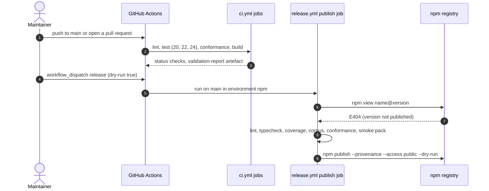

**Failure and error paths.**

| # | What goes wrong | Detected in | What the system does | State left behind | Recovery |
| --- | --- | --- | --- | --- | --- |
| 1 | Any lint, type, test, coverage, corpus, example or conformance failure | The CI job | The job fails; other matrix entries still run (`fail-fast: false`) | Pull request blocked if checks are required | Fix and push |
| 2 | Workflow file mistakes | actionlint in the `lint` job | Lint job fails | Unchanged | Fix the workflow |
| 3 | The validator crashes while writing the report | CI step "Write the validation report of the corpus" | Accepts exit 1 (invalid documents expected), fails on 2 | Partial report | Inspect the job log |
| 4 | Release started from another branch | `if: github.ref == 'refs/heads/main'` | Job skipped | Nothing published | Run from `main` |
| 5 | The version is already on npm | Release version check | `::error::<name>@<version> is already on npm. Raise the version in package.json first.`; exit 1 | Nothing published | Raise the version |
| 6 | npm cannot be reached or answers unexpectedly | Release version check | `::error::Could not ask npm whether <name>@<version> exists: …`; exit 1 | Nothing published | Retry later |
| 7 | Missing or invalid token (unauthenticated publish) | `npm publish` | The step fails | Nothing published | Add `NPM_TOKEN` or configure trusted publishing |
| 8 | Nobody reviews the publish (environment without protection rules) | Not detected | The job runs without approval | Possible unreviewed publish | Add required reviewers to the `npm` environment before the first real release |
| 9 | Upstream artefacts changed and the release runner has no cache | `artefacts:fetch` in the release job | Checksum mismatch; release stops | Nothing published | Update the lock file (5.7, row 1) |

### 5.11 Scheduled check of the upstream artefacts

**Trigger and actors.** The schedule of `.github/workflows/artefacts.yml` (cron `23 4 * * 1,4`, Mondays and Thursdays at 04:23 UTC), or a maintainer starting it by hand (`workflow_dispatch`). Actors: GitHub Actions, `actions/cache@v6`, `scripts/fetch-artefacts.ts` with `fetchArtefacts` and `checkUpstream` (`scripts/lib/artefacts.ts`), the official sources. The workflow has not run yet (section 1.2).

**Preconditions.** The workflow is on `main` and enabled (GitHub turns off scheduled workflows in a public repository after 60 days without activity). The official sources are reachable. Why the check exists: the PINT AE archive is published at an unversioned URL ([ADR-007](docs/decisions.md#adr-007-validation-artefacts-are-downloaded-and-pinned-not-committed)).

**Happy path.** The two jobs run in parallel, each with `permissions: contents: read` and a 10-minute timeout.

1. Job `cache` ("Keep the verified artefacts cached"): checkout, Node.js 24, `npm ci`.
2. `actions/cache@v6` restores `validator/.artefacts` under the key `validation-artefacts-<hashFiles('validator/artefacts.lock.json')>`, the same key as the `conformance` job of `ci.yml`. Using the entry twice a week stops GitHub removing it after 7 days without use.
3. `npm run artefacts:fetch` re-checks the restored files: `fetchVerified` reads each cached file and compares its SHA-256 with the lock file, so nothing is downloaded; the archive entries are extracted again and `MANIFEST.json` is rewritten. It prints `Verified <n> files (PINT AE <version>, <UBL version>, <jars>).`
4. On a cache miss (first run, or the entry was removed), step 3 downloads and verifies every file instead, and the cache action saves the folder under the key when the job ends successfully.
5. Job `upstream` ("Upstream files still match the lock file"): checkout, Node.js 24, `npm ci`, then `npm run artefacts:fetch -- --upstream`.
6. `checkUpstream(lock)` creates an empty temporary folder (`mkdtemp`, prefix `einvoice-ae-upstream-`), runs `fetchArtefacts` into it so that every file is downloaded afresh and verified against the lock file, and deletes the folder in a `finally` block, whatever the outcome.
7. It prints `The official sources still serve the pinned files: <n> files match validator/artefacts.lock.json.` and both jobs pass. Nothing is committed and no file is kept.

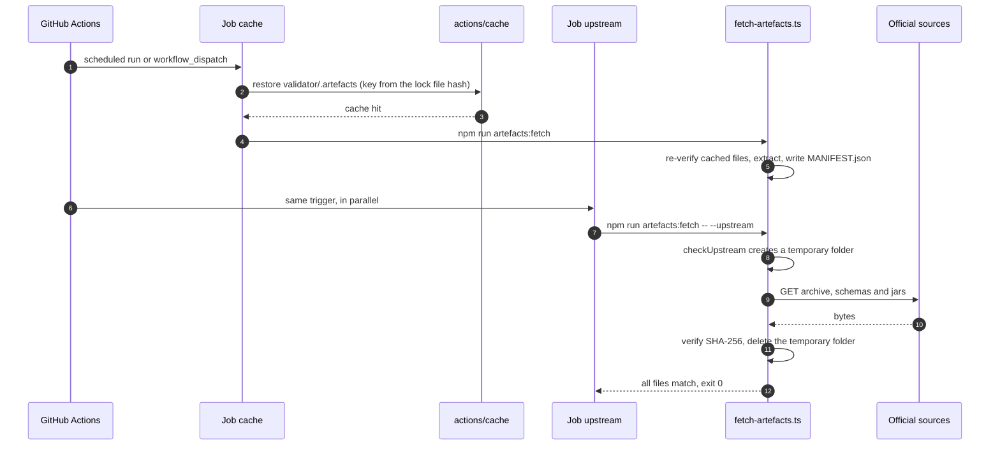

**Failure and error paths.**

| # | What goes wrong | Detected in | What the system does | State left behind | Recovery |
| --- | --- | --- | --- | --- | --- |
| 1 | A file at an official URL was replaced (for example a new `resources.zip` without a new version number) | `verifyChecksum` inside `checkUpstream` | `ChecksumMismatchError`: `Checksum mismatch for <url>` with the expected and actual hash and `The upstream file changed. Read the release notes, review the new artefacts, then update validator/artefacts.lock.json in a separate commit.`; exit 1; only the `upstream` job fails. The `cache` job passes on a cache hit, because the cached files still match the lock file | Temporary folder deleted; the cache still holds the pinned files, so pull-request CI keeps passing; the lock file is stale and a fresh clone or a run without the cache fails at `artefacts:fetch` | Follow [Updating to a new release](docs/validation-artefacts.md#updating-to-a-new-release); the new lock file gives a new cache key |
| 2 | The same upstream change while the cache entry is missing | `fetchVerified` in the `cache` job | `ChecksumMismatchError` there too; both jobs fail and nothing is saved to the cache | No cache; the `conformance` job of every pull request now fails at the artefact step | As row 1 |
| 3 | A source is unreachable or answers with an HTTP error | `httpFetcher` | Three attempts with a 60 s timeout each, waiting 1, 2 and 3 s after the failures; then `Download failed after 3 attempts: <url>`; exit 1; the `upstream` job fails (the `cache` job too on a cache miss) | Nothing changed; temporary folder deleted | Run the workflow again by hand later; a transient failure says nothing about the files |
| 4 | The schedule is turned off after 60 days without repository activity | GitHub | The workflow stops running | No upstream watch; the cache entry is removed after 7 days without use, so the next CI run downloads afresh | Enable the workflow again in the Actions tab and start it by hand ([ADR-007](docs/decisions.md#adr-007-validation-artefacts-are-downloaded-and-pinned-not-committed)) |

### 5.12 Run the mock provider and the validator from the command line

**Trigger and actors.** A developer runs `npm run mock-asp` (`scripts/mock-asp.ts`) to try a client by hand, or `npm run validate -- <file-or-folder>... [--json]` (`scripts/validate.ts`) to validate documents. Actors: developer, `MockAspServer`, `runValidator`, Docker, the `Validator` in the container. Both are developer tools and are not shipped.

**Preconditions.** `npm ci` has been run. For the mock: the port (`MOCK_ASP_PORT`, default 58800) is free on 127.0.0.1. For the validator: Docker is running, the image is built (`npm run validator:build`), and the files are inside the repository.

**Happy path.**

1. `scripts/mock-asp.ts` reads `MOCK_ASP_PORT` (default 58800), `MOCK_ASP_API_KEY` (default `local-demo-key`) and `MOCK_ASP_CALLBACK_SECRET` (default `local-demo-secret`) from the environment.
2. It creates `new MockAspServer({ apiKey, callbackSecret, processingDelayMs: 500 })` and calls `listen(port)`, which binds to 127.0.0.1.
3. It prints `Mock ASP listening on http://127.0.0.1:<port>`, the `POST` and `GET` routes, and that it is a test double.
4. Requests behave as in 5.4 and 5.5; everything is kept in memory.
5. Ctrl+C (SIGINT) or SIGTERM calls `close()`, which clears pending timers and closes every connection; the process exits 0.
6. `scripts/validate.ts` expands the arguments: a folder becomes its `.xml` files in sorted order (not recursive), a file stays as it is.
7. `runValidator(files)` starts one container for all files (4.11).
8. Without `--json` it prints `Saxon-HE <version> on Java <version>`, then one line per file: `valid` or `INVALID`, the file, and the first detail (the error, the first XSD message, or the fatal rule IDs). With `--json` it prints the whole report.
9. It exits 0 when every document is valid and 1 when any is invalid.

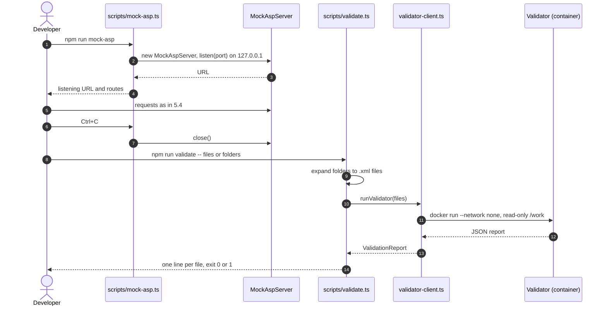

**Failure and error paths.**

| # | What goes wrong | Detected in | What the system does | State left behind | Recovery |
| --- | --- | --- | --- | --- | --- |
| 1 | The port is in use (another mock, or `npm run example:submit` on 58800) | `MockAspServer.listen` (the server's `error` event) | Prints `listen EADDRINUSE: address already in use 127.0.0.1:<port>`; exit 1 | Nothing listening | Stop the other process or set `MOCK_ASP_PORT` |
| 2 | `MOCK_ASP_PORT` is not a number | `server.listen` | Prints `options.port should be >= 0 and < 65536. Received type number (NaN).`; exit 1 | Nothing listening | Set a port number |
| 3 | A request with a wrong or missing API key | `MockAspServer` | 401 `UNAUTHORISED` (5.4, row 3) | Unchanged | Use the value of `MOCK_ASP_API_KEY` |
| 4 | The mock is stopped while submissions are processing or callbacks are pending | `close()` | Timers are cleared, so pending decisions and callbacks never happen | Every submission is lost (memory only) | Start the mock again and resubmit |
| 5 | `npm run validate` with no file, or only folders without `.xml` files | `main` in `scripts/validate.ts` | Prints `Usage: npm run validate -- <file-or-folder>... [--json]`; exit 2 | No container started | Pass XML files or folders that contain them |
| 6 | A path that does not exist | `statSync` in `expand` | Prints `ENOENT: no such file or directory, stat '<path>'`; exit 2 | No container started | Correct the path |
| 7 | Docker not running, the image not built, or a file outside the repository | `runValidator`, `dockerArguments` | The messages of 5.7, rows 4, 5 and 11; exit 2 | No report | As in 5.7 |
| 8 | Some documents are invalid | `Validator` in the container | `INVALID` lines with the first finding; exit 1 | Report printed | Read the findings; `--json` lists every finding |

---

## 6. Cross-cutting concerns

### 6.1 Security model

The library has no users, sessions or roles: deciding who may build, issue, credit or submit documents is the calling application's job. Its own controls protect data in transit, issued documents and the tooling.

| Threat | Control | Where |
| --- | --- | --- |
| API key or documents sent in clear text | https required unless the host is this machine; `allowInsecureHttp` is an explicit opt-in for tests | `checkedUrl` in `src/provider/http-client.ts` |
| Duplicate submissions after a lost response | Document number as `Idempotency-Key`; provider returns the original submission; 409 for different content | `HttpAspClient.submit`, `MockAspServer` |
| Body changed in transit to the provider | `X-Document-SHA256` sent with each submission; the mock answers `DIGEST_MISMATCH` | `toSubmission`, `MockAspServer` |
| Forged or replayed status callbacks | HMAC-SHA256 over timestamp and body, constant-time comparison, 300-second window, per-process signature memory | `src/provider/callback.ts` |
| Issued document changed or replaced | Deep freeze, SHA-256 of the exact bytes, ledger refuses update, delete and replacement, fingerprint re-checked on read | `src/immutability.ts` |
| Over-crediting through concurrent credit notes | Ledger queue; cap on the total checked before insert (per-line quantities rely on a current `alreadyCredited`, 5.3 row 13) | `DocumentLedger.issue` (one process; several need the planned store) |
| Card data on invoices | Only masked card numbers accepted | `validatePaymentMeans` |
| Requests from the mock to arbitrary hosts | Callback host allow-list, loopback by default; mock bound to 127.0.0.1 by default | `MockAspServer` |
| Oversized bodies | Callback handler 64 KiB and early close; mock 5 MiB | `createCallbackHandler`, `MockAspServer` |
| Tampered or replaced validation artefacts | SHA-256 for every file, path-traversal guard, minimal ZIP reader | `scripts/lib/artefacts.ts`, `scripts/lib/zip.ts` |
| XML external entities in validated documents | DOCTYPE disallowed, external entities off, `ACCESS_EXTERNAL_DTD` empty, schema access limited to local files | `Validator.java` |
| Validator escaping its sandbox | `--network none`, `--memory 1g`, `--cpus 2`, read-only mount, user 10001 | `dockerArguments`, `validator/Dockerfile` |
| Supply chain | No runtime dependencies; exact-pinned development dependencies with a lockfile; base images and actionlint pinned by digest; Dependabot for npm, Actions and both Docker directories; npm provenance on release. GitHub Actions are referenced by major-version tag (for example `actions/checkout@v7`), not by commit SHA | `package.json`, `.github/` |
| Unreviewed publishing | Manual release, dry run by default, `main` only, `npm` environment (reviewers still to be configured) | `.github/workflows/release.yml` |

### 6.2 Configuration and secrets

- **Library options are passed in code**; the library reads no environment variables. The options are listed in the [README](README.md#configuration): `vatRounding`, `uuid` and `generateUuid`, `timeoutMs`, `retry`, `callbackUrl`, `allowInsecureHttp`, `callbackHosts`.
- **Scripts read `process.env`** and do not load `.env` files. Values in [`.env.example`](.env.example), none secret: `MOCK_ASP_PORT` (58800), `MOCK_ASP_API_KEY`, `MOCK_ASP_CALLBACK_SECRET`, `EXAMPLE_CALLBACK_PORT` (58801), `EINVOICE_AE_TEST_PORTS` (58801-58809), `EINVOICE_AE_VALIDATOR_IMAGE` (`einvoice-ae-validator:local`).
- **Real secrets** (a provider API key, a callback secret) belong to the application: it passes them to `HttpAspClient` and `createCallbackHandler` from its own secret store. `.gitignore` excludes `.env` and `.env.*` except `.env.example`.
- **CI secrets**: only `NPM_TOKEN` for the release job (unless npm trusted publishing is used instead).

### 6.3 Logging and observability

- The library writes no logs (there is no `console` call in `src/`). It exposes what an application needs to log or measure: the `onRetry` hook (`attempt`, `delayMs`, `reason`), `SubmissionReceipt.attempts` and `replayed`, `AspUnavailableError.retryAfterMs`, and errors carrying `code`, `path`, `rule`, `status` and provider `errors`.
- The mock records `requestCount`, `submissions` and `callbackDeliveries` for assertions.
- Scripts print one-line results and exit with meaningful codes (`npm run validate`: 0, 1, 2).
- CI uploads the `validation-report` artefact; the coverage `text-summary` appears in the log of each `test` job (the `lcov` report is written to `coverage/` but not uploaded). There are no metrics or traces; that is the application's choice.

### 6.4 Performance

- Calculation uses BigInt only where exactness needs it and converts results to numbers once; decimal text is limited to 40 characters so BigInt values stay small.
- `DocumentLedger.creditedAmount` and `creditedQuantities` scan `store.list()`, which is linear in the number of stored documents; a database store should index credit notes by the invoice they reference.
- The submission time is bounded: at most `maxAttempts` attempts of `timeoutMs` each, with delays each capped at `maxDelayMs` (defaults: 5 attempts, 10 s, 10 s).
- Validation runs one container per batch and compiles the Schematron stylesheets once per run; the property test validates a folder rather than a long file list (the Windows command-line limit). JVM flags: `-XX:+UseSerialGC -XX:MaxRAMPercentage=75 -Xss4m`.
- The latest CI run on `main` finished in under a minute per job, with the artefact cache in place.

### 6.5 Accessibility and internationalisation

- **Accessibility:** not applicable; there is no user interface. A human-readable rendering (FR-22) would need its own accessibility review.
- **Internationalisation:** error messages are in English. Document numbers may use any Unicode characters that XML can carry; the idempotency key is percent-encoded UTF-8 so that, for example, Arabic-Indic digits travel in a header. Amounts are written with a full stop and two decimals regardless of locale; dates are ISO 8601; documents are UTF-8. Any ISO 4217 currency is accepted with an AED exchange rate, and AED amounts are added as the UAE requires.

---

## 7. Execution roadmap

### 7.1 Remaining files to be created, in order of implementation priority

Only work that the repository documents as not built, pending or on its roadmap. Paths marked "proposed" do not exist yet and are suggestions. The order puts what a production user would hit first (out-of-date status, multi-process storage) ahead of new document features, and work blocked by outside parties last.

| Priority | File | Purpose | Depends on | Acceptance criteria | Size |
| --- | --- | --- | --- | --- | --- |
| 1 | `README.md` (existing) | Replace the out-of-date sentence "None of the GitHub Actions workflows has run yet: the repository has not been pushed." with the current CI status of `main`, and say that the release and scheduled artefact workflows have not run yet. | None | The statement matches the Actions history; the 27 September local-run results stay as recorded; `npm test` still passes (`test/unit/readme-example.test.ts` compares parts of the README with `examples/`). | S |
| 2 | `src/stores/postgres-document-store.ts` (new, proposed) | A `DocumentStore` for PostgreSQL (README roadmap): insert-only, unique document number, and for a credit note the number check and credit cap atomic with the insert, for example one transaction that locks the invoice row ([ADR-013](docs/decisions.md#adr-013-issued-documents-are-fingerprinted-and-frozen-corrections-are-credit-notes)). | Decision 2 | Implements `get`, `insert` and `list`; refuses an existing number; two processes issuing credit notes for one invoice at the same time cannot exceed its total; the package still has no runtime dependency, or the store ships separately as decided. | L |
| 3 | `db/migrations/0001_document_store.sql` (new, proposed) | Schema for the store: issued documents (number, kind, XML, SHA-256, issue time, totals, credited invoice) with a unique number, and either a credited-total column with a CHECK constraint or row locking. | Priority 2 | Applies to an empty database; a duplicate number and a credit above the invoice total are refused even when the ledger is bypassed; the application role has no UPDATE or DELETE grant. | M |
| 4 | `test/integration/postgres-document-store.test.ts` and `vitest.integration.config.ts` (new, proposed) | Run the ledger cases of `test/unit/immutability.test.ts` against PostgreSQL in Docker, plus a concurrency test with two separate connections. | Priorities 2 and 3 | Passes locally with Docker; kept out of `npm test`, which needs no Docker. | M |
| 5 | `.github/workflows/ci.yml` (existing, significant change) | Add an integration job with a PostgreSQL service container that runs priority 4. | Priority 4 | Job runs on push and pull request; actionlint passes. | S |
| 6 | `docs/decisions.md` (existing; new ADR-021) | Record where the store lives, the driver, and how atomicity is achieved; update the README Limitations and Roadmap. | Priorities 2 and 3 | Same Context, Decision, Consequences form as the other records. | S |
| 7 | `src/model.ts`, `src/calculate.ts`, `src/validation.ts`, `src/build.ts`, `src/codelists/pint-ae.ts`, `corpus/scenarios.ts` (existing, significant change) | VAT category N and the profit margin scheme (README roadmap); today a line in category N and the profit margin flag are refused with `UNSUPPORTED`, and the `LineTax` and `DocumentLevelTax` unions in `src/model.ts` have no N variant ([ADR-005](docs/decisions.md#adr-005-vat-rates-are-fixed-by-the-category-category-n-is-not-supported)). | Review of the BIS text on N, which carries VAT outside the document totals | `LineTax` accepts N; `SUPPORTED_TAX_CATEGORIES` includes N; a new valid scenario passes the official validation; `test/unit/rule-parity.test.ts` covers every newly cited rule; `test/unit/codelists.test.ts` ("supports every official VAT category except N") and `test/unit/validation.test.ts` ("rejects the profit margin scheme and category N as unsupported") updated to expect N support; ADR-005 superseded; `docs/spec-coverage.md` updated. | L |
| 8 | `validator/artefacts.lock.json`, `scripts/lib/artefacts.ts`, `validator/src/main/java/ae/einvoice/validator/Validator.java`, `test/conformance/official-validation.test.ts` (existing, significant change) | Pin and fetch the PINT AE Self-billing resources next to Billing (the lock file has one `pintAe` entry today), and let the validator choose the Schematron layers by `CustomizationID` (today it loads only `trn-invoice/schematron` and `trn-creditnote/schematron` and picks the layers by root element). | None | `npm run artefacts:fetch` verifies the self-billing files; a self-billing document is checked against the self-billing layers; the official self-billing examples pass in `test/conformance/official-validation.test.ts`, whose example folders are hard-coded to Billing today. | L |
| 9 | `src/model.ts`, `src/constants.ts`, `src/build.ts`, `src/validation.ts`, `src/testing/mock-asp-server.ts`, `corpus/scenarios.ts` (existing, significant change) | Self-billing documents, types 389 and 261 (README roadmap; out of scope in [ADR-001](docs/decisions.md#adr-001-scope-is-pint-ae-billing-104-invoices-and-credit-notes)): the self-billing `CustomizationID` next to `PINT_AE` in `src/constants.ts`, and a `defaultDecision` in the mock that does not reject it with `NOT_PINT_AE`. | Priority 8 | Valid self-billing scenarios pass both Schematron layers; input checks cite the self-billing rule IDs; the mock accepts a valid self-billing document; ADR-001 updated. | L |
| 10 | `src/model.ts`, `src/build.ts`, `src/validation.ts` (existing) | Payee and tax representative parties, attachments, despatch and receipt advice references (README Limitations; not on the roadmap). | Decision 5 | Each addition has a valid corpus scenario and input checks with rule IDs; the "not modelled" notes in `docs/spec-coverage.md` are removed. | M |
| 11 | `src/provider/adapters/<provider>.ts` (new, proposed) | An `AccreditedServiceProvider` for a real ASP, reusing `retry.ts` and `callback.ts` (README roadmap, [ADR-014](docs/decisions.md#adr-014-provider-client-with-idempotency-keys-full-jitter-backoff-and-signed-callbacks)). | Decision 4; a provider publishing its API | Passes the behaviour tests of `HttpAspClient` against the provider's sandbox or recorded responses; the README sentence "None has been run" updated. | L |
| 12 | PDF rendering, location to be decided (new, proposed) | Human-readable rendering of an issued document (README roadmap). | Decision 3 | Renders every valid corpus document; the core package keeps no runtime dependency ([ADR-012](docs/decisions.md#adr-012-no-runtime-dependencies-a-small-deterministic-xml-writer)) unless the decision changes it. | L |

**Pending runs (no new file needed).**

- The first run of `.github/workflows/artefacts.yml` (scheduled Mondays and Thursdays at 04:23 UTC, or start it by hand) to confirm the cache and upstream jobs.
- A dry run of `.github/workflows/release.yml` from `main`, once decision 1 is made.

### 7.2 Decisions Farah must make (not files)

1. **Publish to npm or not, and when.** If yes: create the `npm` environment with required reviewers, choose `NPM_TOKEN` or npm trusted publishing, run the release as a dry run, then for real. The name `einvoice-ae` was free on 4 October 2026.
2. **Where the PostgreSQL store lives:** inside this package with the database client passed in (keeps ADR-012), or a separate package; and which driver.
3. **PDF rendering:** whether it is in scope at all and, if so, as a separate package so that the library keeps no runtime dependency.
4. **Which provider first,** once one publishes an API.
5. **Whether to model** payee and tax representative parties, attachments and despatch or receipt advice references.
6. **Whether and how to report the observations** in [docs/validation-artefacts.md](docs/validation-artefacts.md#observations-about-the-published-artefacts) (including the two rule gaps) to OpenPeppol.
7. **CI runner image:** the CI run of 2 October 2026 carries a GitHub notice that `ubuntu-latest` moves to Ubuntu 26 from 19 October 2026; keep `ubuntu-latest` or pin a version in the workflows.
