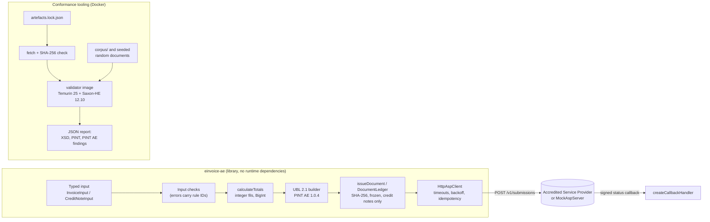

# einvoice-ae

A TypeScript library that builds UAE e-invoices and credit notes in the Peppol PINT AE format. Its input checks name the official rule that each mistake breaks, and its test suite checks the documents it generates against the official UBL 2.1 schema and PINT AE Schematron.

[](https://github.com/fasharif/einvoice-ae/actions/workflows/ci.yml)

> **Not certified. Not tax advice.** einvoice-ae is a portfolio project. It is not accredited by the UAE Ministry of Finance or the Federal Tax Authority, it is not an Accredited Service Provider, and nothing in it is tax or legal advice. All sample data, including every TRN and TIN, is made up, and every demo document carries the note "DEMO - not a tax invoice".

## Sample output

The corpus in this repository, checked with the UBL 2.1 schema and the official PINT AE Schematron (Saxon-HE in Docker). The 17 valid documents all pass; 13 of their lines are left out here:

```text
$ npm run validate -- corpus/valid corpus/invalid/ibr-132-ae.xml corpus/invalid/ibr-147-ae.xml corpus/invalid/ibr-055-ae.xml
Saxon-HE 12.10 on Java 25.0.4
valid    corpus/valid/allowances-and-charges.xml
valid    corpus/valid/continuous-supply.xml
valid    corpus/valid/credit-note-out-of-scope.xml
...
valid    corpus/valid/zero-rated-export.xml
INVALID  corpus/invalid/ibr-132-ae.xml  ibr-132-ae
INVALID  corpus/invalid/ibr-147-ae.xml  ibr-147-ae
INVALID  corpus/invalid/ibr-055-ae.xml  ibr-055-ae
```

The library finds such mistakes before any XML is written, and reports all of them with the rule each one breaks:

```text
$ npm run example:errors
3 problems in the document input:
  - seller.address.subdivision: must be one of AUH, DXB, SHJ, AJM, UAQ, RAK, FUJ for an AE address (got "Dubai") [ibr-128-ae]
  - seller.trn: must be 15 digits, start with 1 and end with 03 [ibr-132-ae]
  - lines[0].unitCode: "PCS" is not a valid UN/ECE Recommendation 20 or 21 unit code [ibr-cl-23]
```

A made-up trade order from [TopFlow Hub](https://github.com/fasharif/topflow), a portfolio B2B platform by the same author, built with the permission of Top Flow, a UAE irrigation supplier. The order is mapped to an invoice and reconciled with the amounts that TopFlow Hub's own money code (its ADR-006) computes:

```text
$ npm run example:topflow
TopFlow order TF-SO-2026-000123 -> invoice DEMO-TF-INV-2026-000123 (5 lines)

field                             TopFlow    invoice  match
line 1 (WS-THR-F) net              670.00     670.00  yes
line 1 (WS-THR-F) VAT               33.50      33.50  yes
...
subtotal                          3642.44    3642.44  yes
discount total                     296.17     296.17  yes
delivery fee                       150.00     150.00  yes
VAT                                189.62     189.62  yes
total                             3982.06    3982.06  yes
```

An issued invoice sent to the mock provider, which fails the first two attempts on purpose. The waits are random (full jitter):

```text
$ npm run example:submit
Issued DEMO-INV-2026-0001: AED 3013.50 due, SHA-256 d744385602ff4b36...
Submitting with two injected failures (HTTP 503, then a lost response):
  retry 1 after HTTP 503, waiting 132 ms
  retry 2 after HTTP 500, waiting 390 ms
  receipt after 3 attempts: status accepted, replayed true
  submissions stored by the provider: 1
Signed callback received: DEMO-INV-2026-0001 is accepted
Submitting the same invoice again returns the same submission: true (replayed true)
Editing the issued invoice is refused: Document DEMO-INV-2026-0001 has been issued and cannot be edited. Issue a credit note to correct it.
Credit note DEMO-CN-2026-0099 for AED 388.50 referencing DEMO-INV-2026-0001: accepted
Invoice DEMO-INV-2026-0100: rejected (DEMO-BUYER-NOT-FOUND)
Replacement DEMO-INV-2026-0101 under a new number: accepted
```

Every generated document is in [`corpus/`](corpus/); [`corpus/valid/standard-rated.xml`](corpus/valid/standard-rated.xml) is a good first read.

## The problem

The UAE is making electronic invoicing compulsory in the Peppol PINT AE format: a pilot from July 2026, businesses with revenue of AED 50 million or more from 1 January 2027, most others from 1 July 2027, B2B first. A PINT AE invoice is a UBL 2.1 XML document that must pass the UBL schema and 302 Schematron rules (170 in the PINT layer, 132 in the UAE layer): UAE-specific identifiers (TRN, TIN, trade licence), amounts in AED on every line, one VAT breakdown per category, exact totals, and rules for credit notes. The rules are published as Schematron, which business systems rarely run themselves, so a mistake can go unnoticed until an Accredited Service Provider rejects the document.

einvoice-ae turns a typed description of an invoice into a conforming document, reports input problems with the ID of the rule they break, keeps issued documents immutable, and submits them to a provider API with safe retries. The package itself does not run the Schematron. Conformance is checked against the official validation artefacts by the test suite, locally and in the CI workflow.

## Features

- **Invoice and CreditNote XML** for PINT AE Billing 1.0.4: types 380 and 480, credit notes 381 and 81 that reference the credited invoice.
- **VAT categories S, Z, E, O and AE** with the rates, exemption reasons and breakdown rules the specification requires; special transactions (exports, free trade zone, deemed supply, summary invoice, continuous supply, disclosed agent billing, e-commerce).
- **Integer money.** Amounts are integer fils; quantities, percentages and exchange rates are exact decimals (BigInt). Each multiplication (quantity × price, base × percent, amount × rate) is rounded once, half away from zero. VAT is rounded per category by default, or per line for systems that store line VAT, with a guard for the 0.02 tolerance of the official rule.
- **Input checks with rule IDs**, for example `seller.trn: must be 15 digits, start with 1 and end with 03 [ibr-132-ae]`. Each of the 101 rules the checks mirror has a unit test. TRN and TIN formats are checked exactly as far as the specification defines them; no checksum is invented.
- **AED amounts** on every line (BTAE-08, BTAE-10) and for the totals (IBT-111, BTAE-20) when the invoice is in another currency.
- **Immutable documents.** Built and issued documents are deep-frozen, and each issued one gets a SHA-256 fingerprint. The ledger refuses edits, deletions and a different document under an issued number.
- **Credit notes.** A credit note must reference one invoice in the ledger, must not be dated before it and must not take the credited total above the invoice total. Calls on one ledger run one at a time, so concurrent credit notes cannot both pass that check. Partial credits are pro-rated, so the credit notes for an invoice add up to it exactly.
- **Provider client** (`einvoice-ae/provider`): the Accredited Service Provider interface and an HTTP client with per-attempt timeouts, exponential backoff with full jitter, and idempotency by document number. It honours `Retry-After`, and stops with `retryAfterMs` when the provider asks for longer than the maximum delay. It needs https for a provider that is not on this machine.
- **Signed status callbacks**, checked with HMAC-SHA256 in constant time within a 300-second window. An exact replay inside the window reaches the application only once (per process).
- **Mock provider** (`einvoice-ae/testing`): an HTTP server with the same API, for local tests. It can inject errors, dropped connections, and slow and lost responses, and by default sends callbacks only to this machine.
- **Conformance tooling**: a Docker image that runs the UBL 2.1 XSD and both official Schematron layers with Saxon-HE. The corpus holds 17 valid and 47 deliberately broken documents (each failing exactly one rule), two documents that show gaps in the published rules and three that reproduce other observations about them. A seeded property test adds 80 random invoices and their partial credit notes.
- **TopFlow Hub example** that maps a made-up delivered order to an invoice and reconciles every amount.
- No runtime dependencies. ESM with type declarations. Node.js 20 or later.

## Architecture



The library validates the input, computes every amount in integer minor units, writes the XML in the exact element order of the UBL 2.1 schemas, and hands issued documents to the provider client. The conformance tooling is separate: it downloads the official artefacts, verifies their checksums, and validates documents in a container with no network access.

## Tech stack and why

| Choice | Why |
| --- | --- |
| TypeScript 6.0 (strict, `exactOptionalPropertyTypes`, `noUncheckedIndexedAccess`) | A typed input model catches many mistakes at compile time; 6.0 because typescript-eslint supports TypeScript below 6.1. |
| BigInt decimal arithmetic, integer fils | Exact money maths, the same model as TopFlow Hub (ADR-006 there). |
| Own XML writer | Deterministic bytes for stable SHA-256 fingerprints, and no runtime dependency. |
| Saxon-HE 12.10 on Temurin 25, in Docker | The official Schematron is published as XSLT 2.0; Java stays inside a container. |
| JAXP schema validation | Standard W3C XML Schema 1.0 validation with secure processing. |
| Vitest 4.1 | Runs on Node.js 20, 22 and 24; Vitest 5 needs Node.js 22. |
| ESLint 10 with typescript-eslint (type-aware) | Catches floating promises, unsafe `any` and non-exhaustive switches. |
| GitHub Actions, Dependabot | Lint, typecheck, tests on three Node.js versions, conformance in Docker, package smoke test, and a scheduled check of the upstream artefacts. |

The reasoning for each choice is in [docs/decisions.md](docs/decisions.md).

## Quick start

Needs Node.js 20.19 or later for the development tools (the library itself runs on Node.js 20 or later); the last command also needs Docker and network access.

```bash
git clone https://github.com/fasharif/einvoice-ae.git
cd einvoice-ae
npm ci
npm test
npm run conformance
```

`npm run conformance` downloads and verifies the validation artefacts, builds the validation image and validates the corpus, the official examples and the seeded random documents. If it stops with a checksum mismatch, the files at the official URL have been replaced (the URL has no version); [docs/validation-artefacts.md](docs/validation-artefacts.md#updating-to-a-new-release) gives the steps to review and pin the new files. `npm run example:topflow`, `npm run example:errors` and `npm run example:submit` print the outputs shown above.

Using the library (after `npm install einvoice-ae`, once published). The package is ESM; `require('einvoice-ae')` also works on Node.js versions that can load ES modules with `require` (20.19 or later in the 20 line, 22.12 or later; the pack smoke test checks it).

```ts
import { buildInvoice, DocumentLedger } from 'einvoice-ae';

const seller = {
  name: 'Demo Irrigation Supplies LLC',
  endpoint: { id: '1000000001' },        // TIN, Peppol scheme 0235
  trn: '100000000100003',                 // made-up TRN
  legalRegistration: { id: 'DEMO-TL-000001', type: 'TL', authority: 'Demo Licensing Authority' },
  address: { street: '1 Demo Street', city: 'Dubai', subdivision: 'DXB', country: 'AE' },
} as const;

const buyer = {
  name: 'Demo Landscaping Contractors LLC',
  endpoint: { id: '1000000002' },
  trn: '100000000200003',
  legalRegistration: { id: 'DEMO-TL-000002', type: 'TL', authority: 'Demo Licensing Authority' },
  address: { street: '2 Demo Road', city: 'Abu Dhabi', subdivision: 'AUH', country: 'AE' },
} as const;

const invoice = buildInvoice({
  id: 'INV-2026-0001',
  issueDate: '2026-09-01',
  dueDate: '2026-10-01',
  note: 'DEMO - not a tax invoice',
  currency: 'AED',
  seller,
  buyer,
  paymentMeans: [{ code: '30', account: { id: 'AE000000000000000000001' } }],
  lines: [
    {
      quantity: '10',
      unitCode: 'XRO',
      unitPrice: 185_00, // AED 185.00 in fils
      item: { name: 'Drip line 16 mm, 100 m roll', description: 'Pressure-compensating drip line' },
      tax: { category: 'S' },
    },
  ],
});

console.log(invoice.totals.taxAmount); // 9250 (AED 92.50)
const issued = await new DocumentLedger().issue(invoice);
console.log(issued.sha256); // SHA-256 of issued.xml
```

`buildInvoice` throws `InvoiceInputError` with every problem it finds, each with a path, a code and, where one applies, the rule ID. Credit notes are built with `buildCreditNote(creditNoteFor(originalInput, issuedInvoice, { id, issueDate, reason }))`. For a partial credit, pass `lines` and the quantities earlier credit notes took (`alreadyCredited: await ledger.creditedQuantities(invoiceId)`). `creditNoteFor` refuses to credit more than was invoiced, and pro-rates allowances, charges and VAT so that the credit notes for an invoice add up to it exactly (ADR-019). TypeScript users need `@types/node`, because the declarations use Node's `fetch`, `AbortSignal` and `http` types.

## Configuration

The library takes all its options in code:

| Option | Where | Default | Meaning |
| --- | --- | --- | --- |
| `vatRounding` | invoice or credit note input | `'category'` | `'line'` sums per-line VAT (checked against the 0.02 tolerance of aligned-ibrp-s-09). |
| `uuid` / `generateUuid` | input / `BuildOptions` | `crypto.randomUUID` | BTAE-07; pass a fixed value for reproducible output. |
| `timeoutMs`, `retry`, `callbackUrl` | `HttpAspClient` | 10 s; 5 attempts, 250 ms base, 10 s cap | Per-attempt timeout and backoff policy, in whole milliseconds. |
| `allowInsecureHttp` | `HttpAspClient` | `false` | Allows plain http to a provider that is not on this machine. For test set-ups only: the API key would travel unencrypted. |
| `callbackHosts` | `MockAspServer` | `localhost`, `127.0.0.1`, `::1` | Hosts the mock provider may send status callbacks to. |

The scripts read these environment variables (values in [`.env.example`](.env.example); nothing in it is secret):

| Variable | Default | Used by |
| --- | --- | --- |
| `MOCK_ASP_PORT`, `MOCK_ASP_API_KEY`, `MOCK_ASP_CALLBACK_SECRET` | 58800, local demo values | `npm run mock-asp`, `npm run example:submit` |
| `EXAMPLE_CALLBACK_PORT` | 58801 | `npm run example:submit` |
| `EINVOICE_AE_TEST_PORTS` | 58801-58809 | provider tests |
| `EINVOICE_AE_VALIDATOR_IMAGE` | `einvoice-ae-validator:local` | `npm run validate`, `npm run test:conformance` |

## Running the tests

| Command | What it runs | Needs |
| --- | --- | --- |
| `npm test` | Unit and provider tests (calculation, input checks with a case for every mirrored rule, XML structure, ledger, credit notes, corpus golden files, TopFlow Hub mapping, HTTP client against the mock provider with injected failures) | Node.js |
| `npm run test:coverage` | The same with V8 coverage | Node.js |
| `npm run validator:build` | Downloads and verifies the artefacts (about 11 MB), builds the validation image on the Temurin base images | Docker, network |
| `npm run test:conformance` | Validates all corpus documents, the 30 official PINT AE examples, and 80 seeded random invoices with their partial credit notes | Docker |
| `npm run conformance` | `validator:build`, then `test:conformance` | Docker, network |
| `npm run example:topflow`, `npm run example:submit`, `npm run example:errors` | The TopFlow Hub reconciliation; a submission to the mock provider with injected failures, a signed callback, a credit note and a rejection; the input-error report | Node.js |
| `npm run corpus:generate -- --check` | Fails when the committed corpus differs from the library output | Node.js |
| `npm run codelists:sync -- --check` | Fails when the code lists differ from the official Schematron | artefacts |
| `npm run artefacts:fetch -- --upstream` | Downloads every artefact again and fails when the official sources no longer serve the pinned files | network |
| `npm run smoke:pack` | Packs the library, installs the tarball in an empty project, imports all entry points and type-checks against the declarations | Node.js |
| `npm run lint`, `npm run typecheck` | ESLint and `tsc --noEmit` | Node.js |

Results of the last local run, on 27 September 2026, from a fresh clone of the branch. Environment: Windows 11 host with Node.js 24.19.0 and Docker Desktop 29.8.0; Linux containers `node:20-bookworm-slim` (Node.js 20.20.2), `node:22-bookworm-slim` (22.23.3) and `node:24-bookworm-slim` (24.21.0); Saxon-HE 12.10 on Temurin Java 25.0.4 in the validation container.

- `npm test`: 504 tests in 15 files passed on all three Node.js versions in the containers and on the host. `npm run test:coverage`: 98.4 % of lines and 93.2 % of branches in `src/` (the generated code-list file excluded); the thresholds in `vitest.config.ts` sit a little below these figures.
- `npm run test:conformance`: 424 tests passed on the host:
  - 17 valid documents with no findings, 47 broken documents that each fail with exactly their rule, 2 gap documents that the published rules accept, and 3 observation documents with exactly the findings [docs/validation-artefacts.md](docs/validation-artefacts.md) describes;
  - 30 official examples (29 valid, 1 fails the UBL schema as published) and the engine check;
  - 323 documents built from 80 seeded random invoices and their partial credit notes, none with any finding, not even a warning.
- `npm run lint`, `npm run typecheck`, the corpus check, `npm run build`, `npm run smoke:pack` (ESM import, `require()`, type declarations, no references to missing source maps) and the three examples passed on all three Node.js versions in the containers. The TopFlow Hub reconciliation matched all 15 amounts.
- On the host, the rest of the CI sequence also passed: artefact download with SHA-256 checks (95 files), the upstream check (the official sources still serve the pinned files), the code-list check, the image build and actionlint 1.7.12 with no findings.

None of the GitHub Actions workflows has run yet: the repository has not been pushed.

On Windows, keep the clone path short. esbuild (used by tsx and Vitest) cannot start its executable from a path longer than 260 characters, so in very deep folders `npm ci` (with npm 10, which runs esbuild's install check) or the first test run fails. Setting `ESBUILD_BINARY_PATH` to an `esbuild.exe` of the same version at a shorter path works around it; the fresh-clone run on the host above used that.

## Folder structure

```text
src/
  build.ts            UBL 2.1 Invoice and CreditNote builder
  calculate.ts        totals, VAT breakdown, AED amounts (integer minor units)
  validation.ts       input checks mapped to rule IDs
  model.ts            typed input model (fields named after IBT/BTAE terms)
  immutability.ts     SHA-256 fingerprints, DocumentLedger
  credit-notes.ts     creditNoteFor: whole and pro-rated partial credit notes
  decimal.ts money.ts identifiers.ts xml.ts xpath-emulation.ts freeze.ts constants.ts errors.ts
  codelists/          generated.ts (from the Schematron) and pint-ae.ts (names)
  provider/           ASP interface, HttpAspClient, retry policy, signed callbacks
  testing/            MockAspServer with failure injection
corpus/
  scenarios.ts        17 valid scenarios built with the library
  broken.ts gaps.ts observations.ts   mutations for broken, gap and observation documents
  valid/ invalid/ gaps/ observations/ manifest.json   generated documents (committed)
validator/
  Dockerfile          Temurin 25 + Saxon-HE; no network needed at build time
  src/main/java/...   Validator.java (XSD + both Schematron layers, JSON output)
  artefacts.lock.json official sources and SHA-256 of every downloaded file
examples/
  topflow-order.ts    TopFlow Hub order to invoice, with reconciliation
  submit-to-mock-asp.ts  issue, submit with injected failures, callback, credit note, rejection
  input-errors.ts     the input-error report above (a test keeps the two identical)
  readme-usage.ts     the usage example above (a test keeps the two identical)
scripts/              artefact fetch, code-list sync, corpus generation, validate, smoke test
test/                 unit/, provider/, conformance/ and shared helpers (seeded random documents)
docs/                 decisions.md, spec-coverage.md, validation-artefacts.md
.github/              workflows (CI, release, artefact check), Dependabot, actionlint image
```

## Design decisions

The short records are in [docs/decisions.md](docs/decisions.md). The main ones: integer money with a single rounding step (ADR-002, ADR-003); following the official rule where it uses binary floating point, so documents never fail on a half-fil tie (ADR-004); downloading the validation artefacts pinned by SHA-256 instead of committing them, because of their licence terms (ADR-007); code lists extracted from the Schematron with a drift check (ADR-009); idempotent provider submissions keyed by document number (ADR-014); partial credit notes pro-rated so that they add up to the invoice (ADR-019); and a rejected document replaced under a new number (ADR-020). What the library supports and how each rule is handled is in [docs/spec-coverage.md](docs/spec-coverage.md).

## Limitations and roadmap

- **Not certified, not an ASP.** The library produces and checks documents; sending them to the UAE network needs an Accredited Service Provider. No provider API is standardised or public, so `HttpAspClient` targets the API of the mock server. A real integration means implementing `AccreditedServiceProvider` for the chosen provider. None has been run.
- **The mock provider is for local tests.** It keeps everything in memory, runs only structural checks and is not hardened for a network; run it on a loopback address.
- **Not supported:** self-billing (PINT AE Self-billing), VAT category N and the profit margin scheme, attachments, payee and tax representative parties, despatch and receipt advice references. Card numbers (IBT-087) are refused unless masked: the last four digits, optionally preceded by mask characters and at most the first six digits (for example `XXXXXXXXXXXX1234`, as in the official examples).
- **Stricter than the published rules** where two rules do not run as written (emirate codes on seller and buyer addresses, credit note VAT totals); details in [docs/validation-artefacts.md](docs/validation-artefacts.md). These gaps and the other observations there have not been reported to OpenPeppol yet.
- **Unversioned upstream artefacts.** The PINT AE resources URL has no version, so an upstream change breaks the checksum check until the lock file is updated. CI validates with its cached copy of the pinned files, and a scheduled workflow reports an upstream change on its own (ADR-007).
- **Storage.** `DocumentLedger` ships with an in-memory store and serialises the calls made through one ledger object. A production store must be insert-only (for example a database table without UPDATE or DELETE grants), and when several processes share it, the store must make the number check and the credit cap atomic with the insert (for example one transaction that locks the invoice row). Credit notes that reference several invoices are refused, because the document does not say how the amount is split.
- **The TopFlow Hub mapping is an example.** It is not wired into TopFlow Hub. TopFlow Hub does not store the buyer's Peppol endpoint or licence authority, so the mapping takes them as options. It invoices delivered orders only, takes the list prices from the quotation when given, and refuses an order whose list prices it cannot recover exactly (ADR-018).
- **Not published yet.** The package is ready for npm (the name `einvoice-ae` was free on 27 September 2026, checked with `npm view`), with a manual, dry-run-by-default release workflow with provenance. It has not been published.
- **Roadmap:** the self-billing specification, category N, a PostgreSQL `DocumentStore`, a human-readable PDF rendering, and provider adapters once providers publish their APIs.

## Licence

MIT, see [LICENSE](LICENSE). The PINT AE validation artefacts, the UBL 2.1 schemas and Saxon-HE are not part of this repository; they are downloaded from their official sources under their own terms (see [docs/validation-artefacts.md](docs/validation-artefacts.md)). The validation image contains them, so it is for local and CI use only and is never pushed to a registry.
