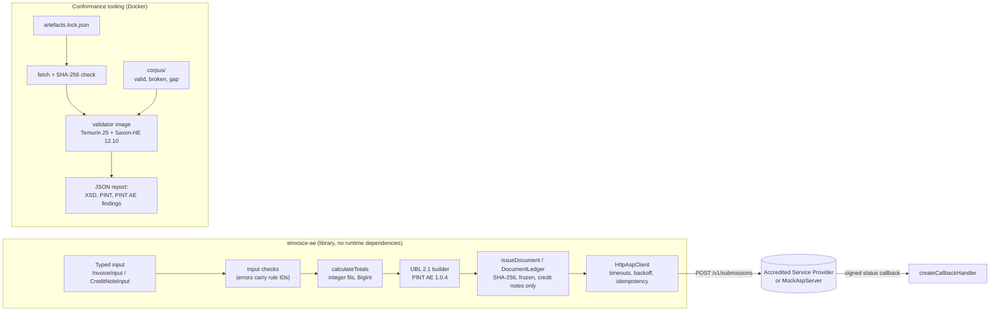

# einvoice-ae

A TypeScript library that builds UAE e-invoices and credit notes in the Peppol PINT AE format and checks them against the official validation rules.

[](https://github.com/fasharif/einvoice-ae/actions/workflows/ci.yml)

> **Not certified. Not tax advice.** einvoice-ae is a portfolio project. It is not accredited by the UAE Ministry of Finance or the Federal Tax Authority, it is not an Accredited Service Provider, and nothing in it is tax or legal advice. All sample data, including every TRN and TIN, is made up, and every demo document carries the note "DEMO - not a tax invoice".

## Sample output

The corpus in this repository, checked with the UBL 2.1 schema and the official PINT AE Schematron (Saxon-HE in Docker):

```text
$ npm run validate -- corpus/valid corpus/invalid/ibr-132-ae.xml corpus/invalid/ibr-147-ae.xml corpus/invalid/ibr-055-ae.xml
Saxon-HE 12.10 on Java 25.0.4
valid    corpus/valid/allowances-and-charges.xml
valid    corpus/valid/continuous-supply.xml
valid    corpus/valid/credit-note-out-of-scope.xml
valid    corpus/valid/credit-note-volume-discount.xml
valid    corpus/valid/credit-note.xml
valid    corpus/valid/deemed-supply.xml
valid    corpus/valid/disclosed-agent.xml
valid    corpus/valid/e-commerce.xml
valid    corpus/valid/exempt.xml
valid    corpus/valid/foreign-currency.xml
valid    corpus/valid/free-trade-zone.xml
valid    corpus/valid/mixed-categories.xml
valid    corpus/valid/prepaid-and-rounding.xml
valid    corpus/valid/reverse-charge.xml
valid    corpus/valid/standard-rated.xml
valid    corpus/valid/topflow-order.xml
valid    corpus/valid/zero-rated-export.xml
INVALID  corpus/invalid/ibr-132-ae.xml  ibr-132-ae
INVALID  corpus/invalid/ibr-147-ae.xml  ibr-147-ae
INVALID  corpus/invalid/ibr-055-ae.xml  ibr-055-ae
```

A TopFlow Hub trade order mapped to an invoice, reconciled with the amounts TopFlow stored:

```text
$ npm run example:topflow
TopFlow order TF-SO-2026-000123 -> invoice DEMO-TF-INV-2026-000123 (5 lines)

field                             TopFlow    invoice  match
line 1 (WS-THR-F) net              670.00     670.00  yes
line 1 (WS-THR-F) VAT               33.50      33.50  yes
...
subtotal                          3642.44    3642.44  yes
discount total                     296.17     296.17  yes
delivery fee                       150.00     150.00  yes
VAT                                189.62     189.62  yes
total                             3982.06    3982.06  yes
```

Every generated document is in [`corpus/`](corpus/); [`corpus/valid/standard-rated.xml`](corpus/valid/standard-rated.xml) is a good first read.

## The problem

The UAE is making electronic invoicing compulsory in the Peppol PINT AE format: a pilot from July 2026, businesses with revenue of AED 50 million or more from 1 January 2027, most others from 1 July 2027, B2B first. A PINT AE invoice is a UBL 2.1 XML document that must pass the UBL schema and 302 Schematron rules (170 in the PINT layer, 132 in the UAE layer): UAE-specific identifiers (TRN, TIN, trade licence), amounts in AED on every line, one VAT breakdown per category, exact totals, and rules for credit notes. The rules are published as Schematron, which business systems rarely run themselves, so a mistake can go unnoticed until an Accredited Service Provider rejects the document.

einvoice-ae turns a typed description of an invoice into a conforming document, reports input problems with the ID of the rule they break, keeps issued documents immutable, and submits them to a provider API with safe retries. Conformance is checked against the official validation artefacts by the test suite, locally and in the CI workflow.

## Features

- **Invoice and CreditNote XML** for PINT AE Billing 1.0.4: types 380 and 480, credit notes 381 and 81 that reference the credited invoice.
- **VAT categories S, Z, E, O and AE** with the rates, exemption reasons and breakdown rules the specification requires; special transactions (exports, free trade zone, deemed supply, summary invoice, continuous supply, disclosed agent billing, e-commerce).
- **Integer money.** Amounts are integer fils; quantities, percentages and exchange rates are exact decimals (BigInt). Each product is rounded once, half away from zero. VAT per category by default, or per line (for systems that store line VAT) with a guard for the 0.02 tolerance of the official rule.
- **Input checks with rule IDs**, for example `seller.trn: must be 15 digits, start with 1 and end with 03 [ibr-132-ae]`. TRN and TIN formats are checked exactly as far as the specification defines them; no checksum is invented.
- **AED amounts** on every line (BTAE-08, BTAE-10) and for the totals (IBT-111, BTAE-20) when the invoice is in another currency.
- **Immutability.** Issued documents get a SHA-256 fingerprint and are deep-frozen. The ledger refuses edits and deletions and a different document under an issued number. A credit note must reference one invoice in the ledger, must not be dated before it and must not take the credited total above the invoice total. Calls on one ledger run one at a time, so concurrent credit notes cannot both pass that check.
- **Provider client** (`einvoice-ae/provider`): the Accredited Service Provider interface and an HTTP client with per-attempt timeouts, exponential backoff with full jitter, and idempotency by document number. `Retry-After` is honoured: the client waits as asked, or, when the provider asks for longer than the maximum delay, stops with an `AspUnavailableError` that carries `retryAfterMs`. Status callbacks are signed with HMAC-SHA256, checked in constant time within a 300-second window, and an exact replay is not passed on twice.
- **Mock provider** (`einvoice-ae/testing`): an HTTP server with the same API that can inject errors, dropped connections, slow and lost responses.
- **Conformance tooling**: a Docker image that runs the UBL 2.1 XSD and both official Schematron layers with Saxon-HE, a corpus of 17 valid and 47 deliberately broken documents (each failing exactly one rule), and two documents that show gaps in the published rules.
- **TopFlow example** that maps a TopFlow Hub order to an invoice and reconciles every amount.
- No runtime dependencies. ESM with type declarations. Node.js 20 or later.

## Architecture



The library validates the input, computes every amount in integer minor units, writes the XML in the exact element order of the UBL 2.1 schemas, and hands issued documents to the provider client. The conformance tooling is separate: it downloads the official artefacts, verifies their checksums, and validates documents in a container with no network access.

## Tech stack and why

| Choice | Why |
| --- | --- |
| TypeScript 6.0 (strict, `exactOptionalPropertyTypes`, `noUncheckedIndexedAccess`) | A typed input model catches many mistakes at compile time; 6.0 because typescript-eslint supports TypeScript below 6.1. |
| BigInt decimal arithmetic, integer fils | Exact money maths, the same model as TopFlow Hub (ADR-006 there). |
| Own XML writer | Deterministic bytes for stable SHA-256 fingerprints, and no runtime dependency. |
| Saxon-HE 12.10 on Temurin 25, in Docker | The official Schematron is published as XSLT 2.0; Java stays inside a container. |
| JAXP schema validation | Standard W3C XML Schema 1.0 validation with secure processing. |
| Vitest 4.1 | Runs on Node.js 20, 22 and 24; Vitest 5 needs Node.js 22. |
| ESLint 10 with typescript-eslint (type-aware) | Catches floating promises, unsafe `any` and non-exhaustive switches. |
| GitHub Actions, Dependabot | Lint, typecheck, tests on three Node.js versions, conformance in Docker, package smoke test. |

The reasoning for each choice is in [docs/decisions.md](docs/decisions.md).

## Quick start

Needs Node.js 20.19 or later for the development tools (the library itself runs on Node.js 20 or later); the last command also needs Docker.

```bash
git clone https://github.com/fasharif/einvoice-ae.git && cd einvoice-ae
npm ci
npm test
npm run example:topflow
npm run validator:build && npm run test:conformance
```

Using the library (after `npm install einvoice-ae`, once published):

```ts
import { buildInvoice, DocumentLedger } from 'einvoice-ae';

const seller = {
  name: 'Demo Irrigation Supplies LLC',
  endpoint: { id: '1000000001' },        // TIN, Peppol scheme 0235
  trn: '100000000100003',                 // made-up TRN
  legalRegistration: { id: 'DEMO-TL-000001', type: 'TL', authority: 'Demo Licensing Authority' },
  address: { street: '1 Demo Street', city: 'Dubai', subdivision: 'DXB', country: 'AE' },
} as const;

const invoice = buildInvoice({
  id: 'INV-2026-0001',
  issueDate: '2026-09-01',
  dueDate: '2026-10-01',
  note: 'DEMO - not a tax invoice',
  currency: 'AED',
  seller,
  buyer: { ...seller, name: 'Demo Buyer LLC', endpoint: { id: '1000000002' }, trn: '100000000200003' },
  paymentMeans: [{ code: '30', account: { id: 'AE000000000000000000001' } }],
  lines: [
    {
      quantity: '10',
      unitCode: 'XRO',
      unitPrice: 185_00, // AED 185.00 in fils
      item: { name: 'Drip line 16 mm, 100 m roll', description: 'Pressure-compensating drip line' },
      tax: { category: 'S' },
    },
  ],
});

invoice.totals.taxAmount; // 9250 (AED 92.50)
const issued = await new DocumentLedger().issue(invoice); // issued.sha256, issued.xml
```

`buildInvoice` throws `InvoiceInputError` with every problem it finds, each with a path, a code and, where one applies, the rule ID. Credit notes are built with `buildCreditNote(creditNoteFor(originalInput, issuedInvoice, { id, issueDate, reason }))`; for a partial credit, pass `lines` and the quantities earlier credit notes took (`alreadyCredited: await ledger.creditedQuantities(invoiceId)`), and `creditNoteFor` refuses to credit more than was invoiced. TypeScript users need `@types/node`, because the declarations use Node's `fetch`, `AbortSignal` and `http` types.

## Configuration

The library takes all its options in code:

| Option | Where | Default | Meaning |
| --- | --- | --- | --- |
| `vatRounding` | invoice or credit note input | `'category'` | `'line'` sums per-line VAT (checked against the 0.02 tolerance of aligned-ibrp-s-09). |
| `uuid` / `generateUuid` | input / `BuildOptions` | `crypto.randomUUID` | BTAE-07; pass a fixed value for reproducible output. |
| `timeoutMs`, `retry`, `callbackUrl` | `HttpAspClient` | 10 s; 5 attempts, 250 ms base, 10 s cap | Per-attempt timeout and backoff policy. |

The scripts read these environment variables (values in [`.env.example`](.env.example); nothing in it is secret):

| Variable | Default | Used by |
| --- | --- | --- |
| `MOCK_ASP_PORT`, `MOCK_ASP_API_KEY`, `MOCK_ASP_CALLBACK_SECRET` | 58800, local demo values | `npm run mock-asp`, `npm run example:submit` |
| `EXAMPLE_CALLBACK_PORT` | 58801 | `npm run example:submit` |
| `EINVOICE_AE_TEST_PORTS` | 58801-58809 | provider tests |
| `EINVOICE_AE_VALIDATOR_IMAGE` | `einvoice-ae-validator:local` | `npm run validate`, `npm run test:conformance` |

## Running the tests

| Command | What it runs | Needs |
| --- | --- | --- |
| `npm test` | Unit and provider tests (calculation, input checks, XML structure, ledger, corpus golden files, TopFlow mapping, HTTP client against the mock provider with injected failures) | Node.js |
| `npm run test:coverage` | The same with V8 coverage | Node.js |
| `npm run validator:build` | Downloads and verifies the artefacts (about 11 MB), builds the validation image on the Temurin base images | Docker, network |
| `npm run test:conformance` | Validates all corpus documents and the 30 official PINT AE examples | Docker |
| `npm run corpus:generate -- --check` | Fails when the committed corpus differs from the library output | Node.js |
| `npm run codelists:sync -- --check` | Fails when the code lists differ from the official Schematron | artefacts |
| `npm run smoke:pack` | Packs the library, installs the tarball in an empty project, imports all entry points and type-checks against the declarations | Node.js |
| `npm run lint`, `npm run typecheck` | ESLint and `tsc --noEmit` | Node.js |

Results of the last local run (Windows 11, Node.js 24.19.0, Docker Desktop 29.8.0 with Linux containers; Saxon-HE 12.10 on Temurin Java 25.0.4 in the container):

- `npm test`: 344 tests in 12 files passed on the host (Node.js 24.19.0), and from a clean clone on Node.js 20.20.2 and 22.23.3 in `node:20-bookworm-slim` and `node:22-bookworm-slim` containers. `npm run test:coverage`: 97.0 % of lines and 90.8 % of branches in `src/` (the generated code-list file excluded).
- `npm run test:conformance`: 97 tests passed: 17 valid documents with no findings, 47 broken documents that each fail with exactly their rule, 2 gap documents that the published rules accept, 30 official examples (29 valid, 1 fails the UBL schema as published; see [docs/validation-artefacts.md](docs/validation-artefacts.md)), and the engine check.
- `npm run smoke:pack` passed on Node.js 24.19.0, and the packed library built and submitted a document on Node.js 20.20.2 in a `node:20-alpine` container.
- The whole CI sequence (install, lint, typecheck, tests with coverage, corpus and code-list checks, build, smoke test, artefact download, image build, conformance, actionlint) also passed from a fresh clone of the branch.

The GitHub Actions workflow has not run yet; it runs on the first push.

On Windows, keep the clone path short. esbuild (used by tsx and Vitest) cannot start its executable from a path longer than 260 characters, so `npm ci` fails in very deep folders.

## Folder structure

```text
src/
  build.ts            UBL 2.1 Invoice and CreditNote builder
  calculate.ts        totals, VAT breakdown, AED amounts (integer minor units)
  validation.ts       input checks mapped to rule IDs
  model.ts            typed input model (fields named after IBT/BTAE terms)
  immutability.ts     SHA-256 fingerprints, DocumentLedger, creditNoteFor
  decimal.ts money.ts identifiers.ts xml.ts xpath-emulation.ts constants.ts errors.ts
  codelists/          generated.ts (from the Schematron) and pint-ae.ts (names)
  provider/           ASP interface, HttpAspClient, retry policy, signed callbacks
  testing/            MockAspServer with failure injection
corpus/
  scenarios.ts        17 valid scenarios built with the library
  broken.ts gaps.ts   mutations for broken and gap documents
  valid/ invalid/ gaps/ manifest.json   generated documents (committed)
validator/
  Dockerfile          Temurin 25 + Saxon-HE; no network needed at build time
  src/main/java/...   Validator.java (XSD + both Schematron layers, JSON output)
  artefacts.lock.json official sources and SHA-256 of every downloaded file
examples/
  topflow-order.ts    TopFlow Hub order to invoice, with reconciliation
  submit-to-mock-asp.ts  issue, submit with injected failures, callback, credit note
scripts/              artefact fetch, code-list sync, corpus generation, validate, smoke test
test/                 unit/, provider/, conformance/ and shared helpers
docs/                 decisions.md, spec-coverage.md, validation-artefacts.md
```

## Design decisions

The short records are in [docs/decisions.md](docs/decisions.md). The main ones: integer money with a single rounding step (ADR-002, ADR-003); following the official rule where it uses binary floating point, so documents never fail on a half-fil tie (ADR-004); downloading the validation artefacts pinned by SHA-256 instead of committing them, because of their licence terms (ADR-007); code lists extracted from the Schematron with a drift check (ADR-009); and idempotent provider submissions keyed by document number (ADR-014). What the library supports and how each rule is handled is in [docs/spec-coverage.md](docs/spec-coverage.md).

## Limitations and roadmap

- **Not certified, not an ASP.** The library produces and checks documents; sending them to the UAE network needs an Accredited Service Provider. No provider API is standardised or public, so `HttpAspClient` targets the API of the mock server. A real integration means implementing `AccreditedServiceProvider` for the chosen provider. None has been run.
- **Not supported:** self-billing (PINT AE Self-billing), VAT category N and the profit margin scheme, attachments, payee and tax representative parties, despatch and receipt advice references. Card numbers (IBT-087) are refused unless masked: the last four digits, optionally preceded by mask characters and at most the first six digits (for example `XXXXXXXXXXXX1234`, as in the official examples).
- **Stricter than the published rules** where two rules do not run as written (emirate codes on seller and buyer addresses, credit note VAT totals); details in [docs/validation-artefacts.md](docs/validation-artefacts.md).
- **Storage.** `DocumentLedger` ships with an in-memory store and serialises the calls made through one ledger object. A production store must be insert-only (for example a database table without UPDATE or DELETE grants), and when several processes share it, the store must make the number check and the credit cap atomic with the insert (for example one transaction that locks the invoice row). Credit notes that reference several invoices are refused, because the document does not say how the amount is split.
- **The TopFlow mapping is an example.** It is not wired into TopFlow Hub. TopFlow does not store the buyer's Peppol endpoint or licence authority, so the mapping takes them as options; it takes the list prices from the quotation when given, and refuses an order whose list prices it cannot recover exactly (ADR-018).
- **Not published yet.** The package is ready for npm (`einvoice-ae` was free when checked with `npm view`), with a manual, dry-run-by-default release workflow with provenance. It has not been published.
- **Roadmap:** the self-billing specification, category N, a PostgreSQL `DocumentStore`, a human-readable PDF rendering, and provider adapters once providers publish their APIs.

## Licence

MIT, see [LICENSE](LICENSE). The PINT AE validation artefacts, the UBL 2.1 schemas and Saxon-HE are not part of this repository; they are downloaded from their official sources under their own terms (see [docs/validation-artefacts.md](docs/validation-artefacts.md)).
